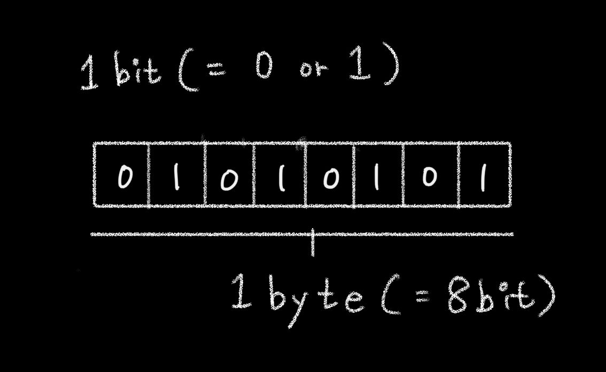

## [back](./../README.md)

 

# 1-2-1 메모리와 데이터

## bit

- 0 또는 1로 표현할 수 있는 하나의 메모리 조각

## 메모리

- 매우 많은 bit로 구성.
- 각 bit는 고유한 식별자(unique identifier)를 통해 위치 확인 가능.

→ 0 또는 1만 표현할 수 있는 비트 단위로 위치를 확인하는 것은 매우 비효율적.

## byte

- 매우 많은 비트를 한 단위로 묶으면  

  1. 검색 시간을 줄일 수 있고  
  2. 표현할 수 있는 데이터의 개수도 늘어남. 
     동시에  
  3. 낭비되는 비트가 생김.

- 자주 사용하지 않는 데이터를 위해 빈 공간을 남겨두기보단 
  제약이 따르더라도 적정한 공간을 묶는 것이 좋음.

- **1byte**는 8개의 bit로구성, 
  bit는 0 또는 1의 값으므로 경우의 수는 2. 
  → 총 256(2의 8승)개의 값 표현 가능.

  

 

`C/C++, java등의 정적 타입 언어`는  
메모리의 낭비를 최소화하기 위해  
데이터 타입별로 할당할 메모리 영역을  
2바이트, 4바이트 등으로 나누어 정해놓았다. 
 
예를 들어 2바이트 크기의 정수형 타입(short)은 
0을 포함해 -32768 ~ + 32767의 숫자만 허용한다. 
 
만약 사용자가 +32768 또는 그 이상의 숫자를 입력하면 
오류가 나거나 잘못된 값이 저장되고 만다. 
 
이 문제에 제대로 대처하기 위해서는  
사용자가 직접 4바이트 크기의 정수 타입(int)등으로 형변환해야 한다. 
 
사용자 입장에서는 꽤나 번거로운 작업이지만  
메모리 용량이 매우 부족했던 시절에는 불가피한 선택이었다. 
  
한편 메모리 용량이 과거보다 월등히 커진 상황에서 등장한  

`자바스크립트`는  
상대적으로 메모리 관리에 대한 압박에서 자유로워졌고 
그래서 메모리 공간을 좀 더 넉넉하게 할당했다. 
 
숫자의 경우 정수형인지 부동소수형인지 구분하지 않고, 
64비트, 즉 8바이트를 확보한다. 
 
덕분에 개발자가 위와 같은 형변환을 걱정해야 하는 상황이 훨씬 덜 발생하게 됐다. 
 
모든 데이터는 바이트 단위의 식별자, 
더 정확하게는 
**메모리 주솟값(memory address)를통해 서로 구분하고 연결**할 수 있다.
