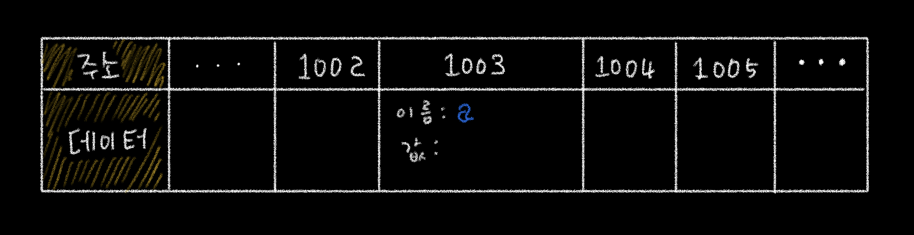

<p>

#### [back](../../../README.md) &nbsp;&nbsp; | &nbsp;&nbsp; write by [Local](https://github.com/blocallee)

</p>

# 1-3-1 변수 선언

### 변수 선언

<p align="center">예제 1-1</p>

```jsx
var a;
```

- 변할 수 있는 데이터를 만든다.
- 식별자는 a로 한다.
- 변수 선언할 떄는 undefined가 된다.

<br>

#### '예제 1-1'의 명령을 받은 메모리 영역의 작업 수행

<p align="center">
  
그림 1-3. 변수 선언에 대한 메모리 영역의 변화
</p>
<p>

`그림 1-3`을 통한 변수 선언 과정.

</p>

1. 메모리에서 비어있는 공간 하나를 확보.
2. `그림 1-3` 에서는 임의로 `1003`번으로 정함.
3. 이 `1003`번 공간의 이름(`식별자`)를 `a`라고 지정.

<br>

<p>

이후 사용자가 `a`에 접근하고자 하면

</p>
<p>

컴퓨터는 메모리에서 `a`라는 이름을 가진 주소를 검색해

</p>
<p>해당 공간에 담긴 데이터를 반환.</p>
