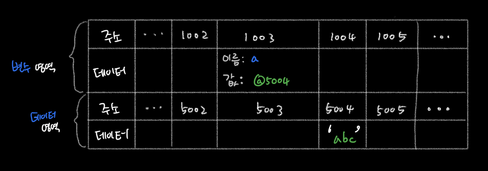
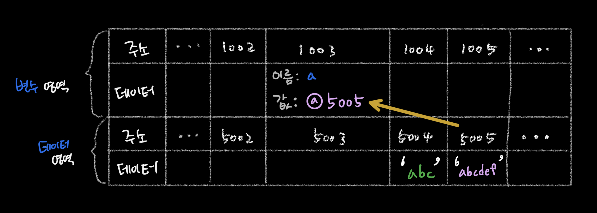

<p>

#### [back](../../../README.md) &nbsp;&nbsp; | &nbsp;&nbsp; write by [Local](https://github.com/blocallee)

</p>

# 1-3-2 데이터 할당

<p align="center">
    
<p> * 이 글은 코어자바스크립트 책을 참고하여 기록하였습니다. </p>
</p>

---

<br>

### 변수 선언과 할당

<p align="center">예제 1-2.</p>

```jsx
// 변수 a 선언
var a;

// 변수 a에 데이터 할당
a = 'abc';

// 변수 선언과 할당을 한 문장으로 표현
var a = 'abc';
```

1. 메모리에서 비어있는 공간을 확보
2. 그 공간의 이름을 a라고 설정 - 변수 선언
3. a라는 이름을 가진 주소 검색
4. 그곳에 문자열 'abc'를 할당 - 할당

<br>

<p>변수 선언과 할당은</P>
<P>나누어서 하든 한 문장으로 하든</P>

**_자바스크립트 엔진은 같은 동작을 수행_** 한다.

<P>그러나!</P>

**`해당 위치에 문자열 'abc'를 직접 저장하지 않는다`** <br>

<P>데이터를 저장하기 위한</P>
<P>별도의 메모리 공간을 다시 확보해 문자열 'abc'를 저장하고</P>
<P>그 주소를 변수 영역에 저장하는 식으로 이뤄진다.</P>

<br>
<br>

#### 01. 데이터 할당에 대한 메모리 영역의 변화

<p align="center">
  
  그림 1-4.
</p>

1. 변수 영역에서 빈 공간(`@1003`)을 확보
2. 확보한 공간의 식별자를 `a`로 지정.
3. 데이터 영역의 빈 공간(`@5004`)에 문자열 `'abc'` 저장.
4. 변수 영역에서 `a`라는 식별자 검색(`@1003`)
5. 앞서 저장한 문자열의 주소(`@5004`)를 `@1003` 공간에 대입.

<br>

<p>? 변수 영역에 직접 대입하지 않는 이유</p>

- 데이터 변환을 자유롭게 할 수있게 함.
- (동시에) 메모리를 더욱 효율적으로 관리 가능.

<details>
  <summary>
    효율적으로 문자열 데이터 변환을 처리하려면 변수와 데이터를 별도의 공간에 나누어 저장하는 것이 최적인 이유
  </summary>
    <br>
    <p> 만약 미리 확보한 공간 내에서만 데이터 변환을 할 수 있다면</p>
    <p> 변환한 데이터를 다시 저장하기 위해서는</p>
    <p> "확보된 공간을 변환된 데이터 크기에 맞게 늘리는 작업이 선행"돼야 할 것이다.</p>
    <br> 
    <p> 해당 공간이 메모리 상의 가장 마지막에 있었다면</p>
    <p> 뒤쪽으로 늘리기만 하면 되니까 어렵지 않겠지만</p>
    <p> 중간에 있는 데이터를 늘려야하는 상황이라면 어떨까?</p>
    <br>
    <p> 해당 공간보다 뒤에 저장된 데이터들을 전부 뒤로 옮기고,</p>
    <p> 이동시킨 주소를 각 식별자에 다시 연결하는 작업을 해야한다.</p>
    <p> → 컴퓨터가 처리해야 할 연산이 많이질 수 밖에 없다.</p>
</details>

<br>
<br>

#### 02. 문자열 'abc' 마지막에 'def'를 추가할 경우

<p align="center">
  
그림 1-5.
</p>

1. `'abcdef'` 라는 문자열을 새로 만든다.<br>
   (컴퓨터는 앞서 `'abc'`가 저장된 공간에 `'abcdef'` 를 할당하는 대신)
2. 만든 문자열 `'abcdef'`를 별도의 공간(`@5005`)에 저장
3. 문자열 `'abcdef'`의 주소(`@5005`)를 변수 공간(`@1003`)에 연결.

<br>
<p>반대로 </p>
<p>'abc'에서 'c'를 제거하라고 해도 새로 만든다.</p>

**`기존 문자열에 어떤 변화를 가하든 상관없이 무조건 새로 만들어 별도의 공간에 저장`**

<p>

-> 기존(`@5004`) 데이터는 자신의 주소를 저장하는 변수가 하나도 없게 되면

</p>

**가비지 컬렉터(garvage collector)의 수거 대상이 된다.**

<br>

---

<br> 
<P>변수 영역과 데이터 영역을 분리하면</P>
<P>중복된 데이터에 대한 처리 효율이 높아진다.</P>

<br>

<P>예를 들면) </P>
<P>500개의 변수에 숫자 5를 할당해야한다.</P>

<br>

<P>각 변수 공간에 매번 5를 할당하려면</P>
<P>숫자형의 경우 8바이트가 필요하니</P>
<P>총 4000(500\*8) 바이트 를 써야한다.</P>

<br> 
<P>그 대신</P>

숫자 5를 별도의 공간에 **`한번만`** 저장하고

<p>해당 주소만 입력할 경우</p>
<p>주소 공간의 크기가 2바이트라고 할 때</p>
<p>1008(500\*2+8) 바이트만 이용하면 된다.</p>
