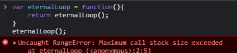
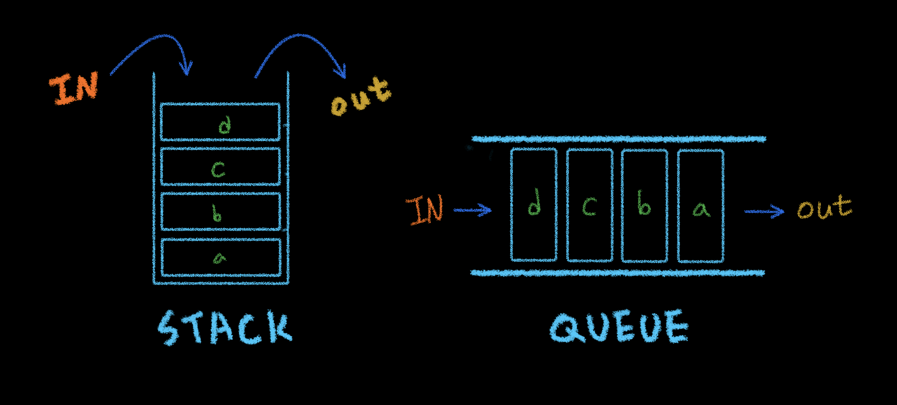
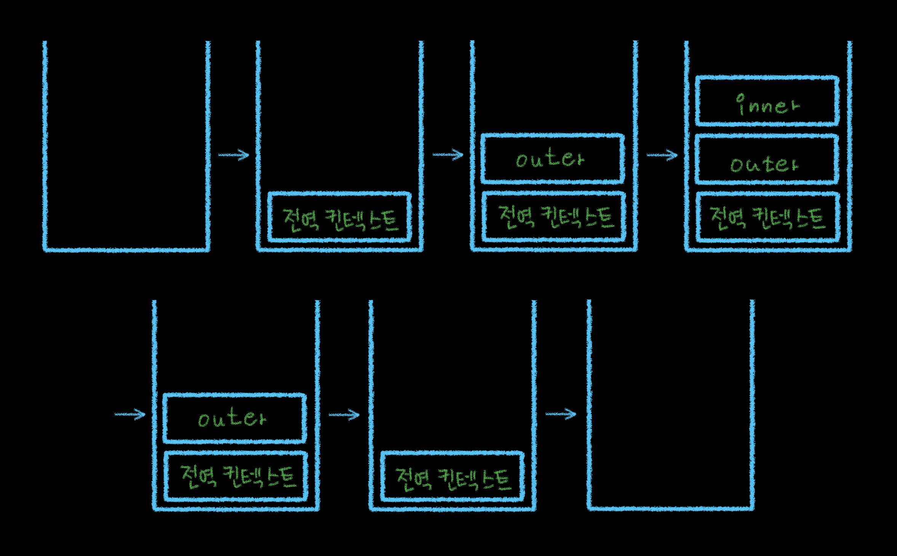
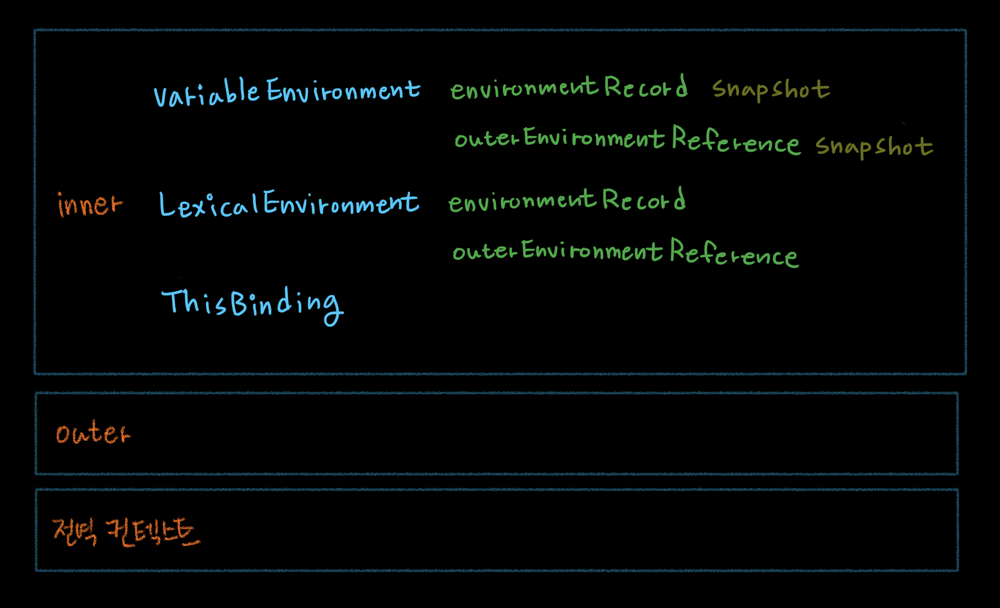

p;&nbsp; | &nbsp;&nbsp; write by [Local](https://github.com/blocallee)

</p>

# 1-1 실행컨텍스트

<p align="center">
    
<p> * 이 글은 코어자바스크립트 책을 참고하여 기록하였습니다. </p>
</p>

---

<br>

## 01. 실행컨텍스트란

> 실행할 코드에 제공할 환경 정보들을 모아놓은 객체

<p>자바스크립트의 동적 언어로서의 성격을 가장 잘 파악할 수 있는 개념이고<br>
자바스크립트에서 가장 중요한 핵심 개념 중 하나.</P>

1. 어떤 실행 컨텍스트가 활성화 되는 시점에
2. 선언된 변수를 위로 끌어올리고 (호이스팅 hoisting)
3. 외부 환경 정보를 구성하고
4. this 값을 설정하는 등의 동작 수행

-> 이로 인해 다른 언어에서는 발견할 수 없는 특이한 현상들이 발생

<br>
<br>

### 스택 stack

> 출입구가 하나뿐인 깊은 우물 같은 데이터 구조

- 비어있는 스택에 순서대로 a,b,c,d를 저장 한다면
- `꺼낼 때는 반대로 d,c,b,a의 순서`로 꺼낼 수 밖에 없다.

<p>데이터를 100개만 저장할 수 있는 우물에
100개 이상의 데이터를 넣으려고 하면 넘칠 것이다.</p>
<p>

많은 프로그래밍 언어들은 스택이 넘칠 때 `에러`를 던친다.

</p>
<br>

크롬 브라우저의 콜스택 초과 시 발생하는 에러

<p align="center">
  
  <p align="center">그림 2-1</p>
</p>

<br>
<br>

### 큐 queue

> 한쪽은 입력만, 다른 한쪽은 출력만을 담당하는 구조.

<br>
<p>양쪽이 모두 열려있는 파이프를 떠올리자.</p>
<p>종류에 따라 양쪽 모두 입력과 출력이 가능한 큐도 있다.</P>
<br>
<p>

비어있는 큐에 순서대로 a,b,c,d를 저장했다면

</p>
<p>

`꺼낼 때도 역시 a,b,c,d의 순서로` 꺼낼 수 밖에 없다.

</p>

<br>
<br>

스택과 큐

<p align="center">
  
  <p align="center">그림 2-2</p>
</p>

<br>

1. `동일한 환경`에 있는 코드들을 실행할 때 필요한 환경 정보들을 모아 컨텍스트 구성.
2. 이 컨텍스트를 콜 스택call stack에 쌓아올렸다가
3. 가장 위에 쌓여있는 컨텍스트와 관련 있는 코드들을 실행하는 식.

<p>-----> 전체 코드의 환경과 순서 보장.</p>
<br>

여기서 `동일한 환경`, 즉 하나의 실행 컨텍스트를 구성할 수 있는 방법

1. 전역공간
2. eval() 함수
3. 함수
4. 등

<p>

**흔히 실행 컨텍스트를 구성하는 방법** 은 **_`함수를 실행`_** 하는 것 뿐이다.

</p>

<p>(ES6에서는 블록에 의해서도 새로운 실행 컨텍스트가 생성된다.)</P>

<br>
<br>
실행 컨텍스트와 콜 스택
<p align="center">예제 2-1.</p>

```javascript
//-----------------------------------(1)
var a = 1;
function outer() {
  function inner() {
    console.log(a); // undefined
    var a = 3;
  }
  inner(); //------------------------(2)
  console.log(a); // 1
}
outer(); //--------------------------(3)
console.log(a); // 1
```

<br>

1. `그림 2-3`과 같이 처음 자바스크립트를 실행하는 순간 `(1)`<br><br>
2. `전역 컨텍스트`가 `콜 스택`에 담긴다.<br><br>
3. 콜 스택에는 전역 컨텍스트 외에 다른 덩어리가 없으므로<br> 전역 컨텍스트와 관련된 코드들을 순차로 진행<br><br>
4. 진행하다 `(3)`에서 `outer` 함수를 호출<br><br>
5. 자바스크립트 엔진은 `outer`에 대한 환경 정보를 수집.<br><br>
6. 수집한 걸 `outer` 실행 컨텍스트를 생성한 후 콜 스택에 담는다.<br><br>
7. 콜 스택의 맨 위에 `outer` 실행 컨텍스트가 놓인 상태가 됐으므로<br> 전역 컨텍스트와 관련된 코드의 실행을 일시중단<br><br>
8. 대신 `outer` 실행 컨텍스트와 관련된 코드, <br>즉 `outer` 함수 내부의 코드들을 순차로 실행<br><br>
9. 다시 `(2)`에서 `inner` 함수의 실행 컨텍스트가 콜 스택의 가장 위에 담기면<br> `outer` 컨텍스트와 관련된 코드의 실행을 중단<br><br>
10. `inner` 함수 내부의 코드를 순서대로 진행.<br>`inner` 함수 내부에서 `a` 변수의 값을 출력<br><br>
11. `inner` 함수의 실행이 종료.<br><br>
12. `inner` 실행 컨텍스트가 콜 스택에서 제거<br><br>
13. `(2)`에서 중단했던 `outer` 컨텍스트가 <br>`(2)`의 다음 줄부터 이어서 실행<br><br>
14. `a` 변수 값 출력<br><br>
15. `outer` 함수의 실행 종료<br><br>
16. `outer` 실행 컨텍스트가 콜 스택에서 제거<br><br>
17. 실행을 중단했던<br> `(3)`의 다음 줄부터 이어서 실행<br><br>
18. `a` 변수의 값을 출력<br>(후 전역 공간에는 더는 실행할 코드 남아있지 않음)<br><br>
19. 전역 컨텍스트 제거<br><br>
20. 아무것도 남지 않은 상태인 콜 스택 종료.

</p>

<br>
<p align="center">
  
</p>

<p align="center">그림 2-3</p>

**전역 컨텍스트**란 개념은 일반적인 실행 컨텍스트와 특별히 다를 것 없다.</p>

<details>
  <summary>(다른 점을 굳이 찾자면)</summary>
  <br>
  <p>
    전역 컨텍스트가 관여하는 대상은 함수가 아닌
    전역 공간이기 때문에 arguments가 없다
  </p>
  <p>
    전역 공간을 둘러싼 외부 스코프란 존재할 수 없기 때문에
  </p>
  <p>
    스코프체인 상에는 전역 스코프 하나만 존재한다.
  </p>
  <p>
    이런 성질들은 구조상 당연히 그럴수밖에 없는 것이다.
  </p>
</details>
<br>
<p>
  최상단의 공간은 코드 내부에서 별도의 실행 명령 없어도
  브라우저에서 자동으로 실행하므로
</p>
<p>

> `자바스크립트 파일이 열리는 순간 전역 컨텍스트가 활성화된다`고 이해하면 된다.

</p>

<br>

---

<br>

<p>스택 구조에서</p>

```
하나의 실행 컨텍스트가 콜 스택의 맨 위에 쌓이는 순간이
곧 현재 실행할 코드에 관여하게 되는 시점임을 알 수 있다.
```

<br>
<p>기존의 컨텍스트는</p>
<p>새로 쌓인 컨텍스트보다 아래에 위치할 수 밖에 없기 때문.</p>
<br>

<p>
어떤 실행 컨텍스트가 활성화될 때
</p>
<p>

```
  자바스크립트 엔진은
  해당 컨텍스트에 관련된 코드들을 실행하는데
  필요한 환경 정보들을 수집해서 실행 컨텍스트 객체에 저장한다.
```

<p>
이 객체는
</p>
<p>
자바스크립트 엔진이 활용할 목적으로 생성할 뿐
</p>
<p>
개발자가 코드를 통해 확인할 수는 없다.
</p>

<br>
<p>여기에서 담기는 정보는 다음과 같다</p>
<p>활성화된 실행 컨텍스트의 수집 정보</p>
<p align="center">
  
</p>

<p align="center">그림 2-4</p>

- `VariableEnvironment` <br>
  : 현재 컨텍스트 내의 식별자들에 대한 정보 + 외부 환경 정보.
  <br>선언 시점의 LexicalEnvironment의 스냅샷(snapshop)으로,
  <br>변경 사항은 반영되지 않음
  <br>

- `LexicalEnvironment` <br>
  : 처음에는 VariableEnvirionment와 같지만
  <br>변경 사항이 실시간으로 반영됨.
  <br>

- `ThisBinding` <br>
  : this 식별자가 바라봐야 할 대상 객체.
