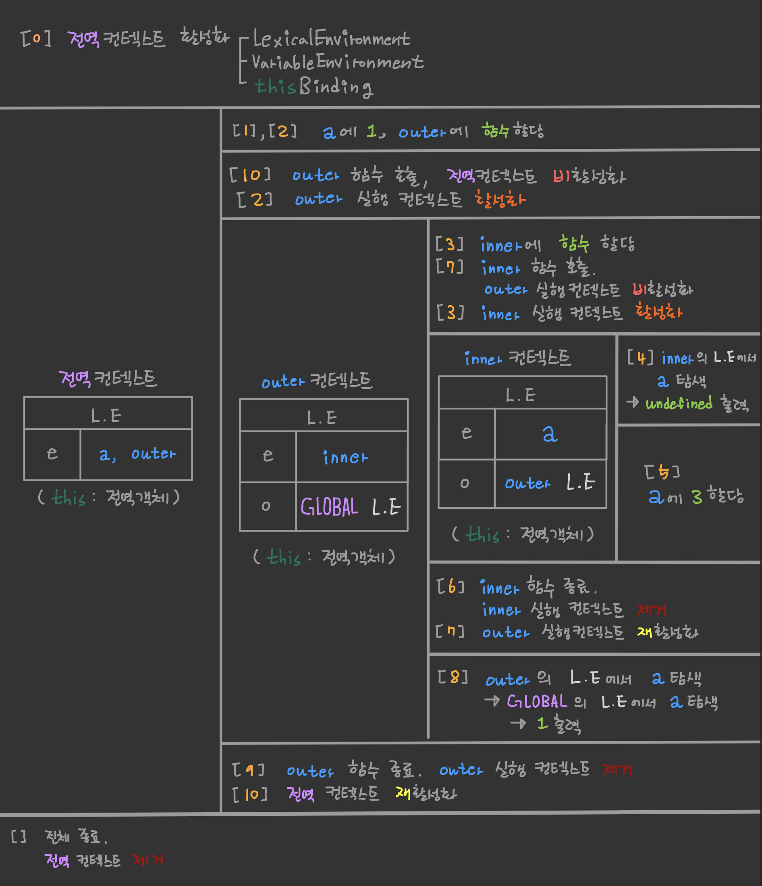
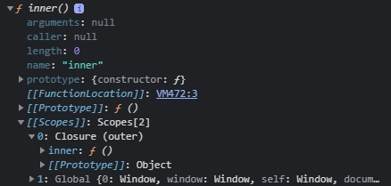
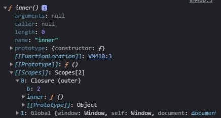
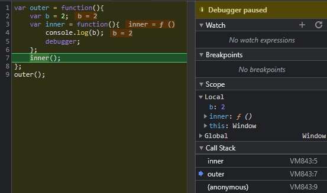
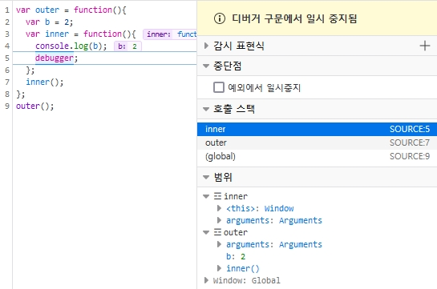

<p>

#### [back](../../../README.md) &nbsp;&nbsp; | &nbsp;&nbsp; write by [Local](https://github.com/blocallee)

</p>

# 3-2 스코프, 스코프 체인, outerEnvironment

<p align="center">
    
<p> * 이 글은 코어자바스크립트 책을 참고하여 기록하였습니다. </p>
</p>

---

<br>

## 스코프 scope

> 식별자에 대한 유효범위

```
어떤 경계 A의 외부에서 선언한 변수는
A의 외부뿐 아니라 A의 내부에서도 접근이 가능하지만,
A의 내부에서 선언한 변수는 오직 A의 내부에서만 접근할 수 있다.
```

<p>
    이런 스코프의 개념은 대부분의 언어에서 존재한다.
</p>
<p>
    자바스크립틀도 예외는 아니지만
</p>

```
ES5까지의 자바스크립트는 특이하게도

전역공간을 제외하면  `오직 함수에 의해서만` 스코프가 생성.
```

<details>

---

<summary>💡 ES6에서 스코프</summary>

<p>ES6에서는 블록에 의해서도</p>
<p>스코프 경계가 발생하게 함으로써 다른 언어와 훨씬 비슷해졌다.</p>    
<p>다만 이러한 블록은 var로 선언한 변수에 대해서는 작용하지 않고</p>

```
오직 새로 생긴
'let', 'const','class', 'strick mode' 에서의 함수 선언 등에 대해서만
범위로서의 역할을 수행한다.
```

<p>ES6에서는 둘을 구분하기 위해</p>    
<p>함수 스코프, 블록 스코프라는 용어를 사용한다.</p>

---

</details>

<br>
<br>
<br>

## 스코프 체인

<br>

```
outerEnvironmentReference 는
현재 호출된 함수가
`선언될 당시`의 LexicalEnvironment를 참조한다.
```

<p>

과거 시점인 `선언될 당시`에서 </p>

<p>

`선언하다`라는 행위가 실제로 일어날 수 있는 시점이란</p>

```
콜 스택 상에서 어떤 실행 컨텍스트가 활성화된 상태일 때 뿐이다.
```

<p>어떤 함수를 선언(정의)하는 행위 자체도 하나의 코드에 지나지 않으며,</p>
<p>모든 코드는 실행 컨텍스트가 활성화 상태일 때 실행되기 때문.</p>

<br>

<p>예를 들어보자</p>

<p>상황</p>

```
`함수 A` 내부에 `함수 B` 선언,
`함수 B` 내부에 `함수 C` 선언한 경우
```

1. `함수 C`의 outerEnvironmentReference는
   <br>
   `함수 B`의 LexicalEnvironment를 참조.
2. `함수 B`의 LexicalEnvironment에 있는 outerEnvironmentReference는
   <br>
   다시 `함수 B`가 선언되던 때(A)의 LexicalEnvironment를 참조.

<br>
<p>이처럼 outerEnvironmentReference는 연결리스트(linked list) 형태를 띤다</p>
<p>'선언 시점의 LexicalEnvironment'를 계속 찾아 올라가면</p>
<p>마지막엔 전역 컨텍스트의 LexicalEnvironment가 있을 것이다.</p>
<p>또한</p>

```
각 outerEnvironmentReference는
오직 자신이 선언된 시점의 LexicalEnvironment만 참조 하고 있으므로
가장 가까운 요소부터 차례대로만 접근할 수 있고
다른 순서로 접근하는 것은 불가능할 것이다.
```

<p>이러한 구조적 특성 덕분에</p>
<p>여러 스코프에서 동일한 식별자를 선언한 경우에는</p>

```
무조건 스코프 체인 상에서 가장 먼저 발견된 식별자에만 접근 가능하게 된다.
```

<br>
<br>
<p>스코프 체인</p>

<p align="center">예제 2-13.</p>

```
01  var a = 1;
02  var outer = function() {
03      var inner = function() {
04          console.log(a);
05          var a = 3;
06      };
07      inner();
08      console.log(a);
09  };
10  outer();
11  console.log(a);
```

- 시작
  1. 전역 컨텍스트 활성화
  2. 전역 컨텍스트 `environmentRecord`에<br> `{ a, outer }` 식별자를 저장.
  3. 전역 컨텍스트는 선언 시점이 없으므로<br>
     전역 컨텍스트 `outerEnvironmentReference`에는 아무것도 담기지 않음.<br>
     (this: 전역 객체)

<br>

- 01 &nbsp; `var a = 1;`
  1. 전역 스코프에 있는 `변수 a`에 `1`을 할당

<br>

- 02 &nbsp; `var outer = function () {};`
  1. 전역 스코프에 있는 `변수 outer`에 `함수` 할당

<br>

- 10 &nbsp; `outer();`
  1. `outer` 함수 호출
     - 이에 따라 전역 컨텍스트의 코드는 10번째 줄에서 임시중단되고<br>
       `outer` 실행 컨텍스트가 활성화되어 02번째 줄로 이동한다.

<br>

- 02 &nbsp; `var outer = function () {};`
  1. outer 실행 컨텍스트의 environmentRecord에<br>
     `{ inner }` 식벌자 저장
  2. `outerEnvironmentReference`에는<br>`outer` 함수가 선언될 당시의 `LexicalEnvironment`가 담긴다.
  3. outer 함수는 전역 공간에 선언됐으므로<br>
     전역 컨텍스트의 `LexicalEnvironment`를 참조복사한다.<br>
     이를 `[ GLOBAL, { a, outer }`]라고 표기하자.<br>
     [ 실행 컨텍스트 이름, { environmentRecord 객체 } ]<br>
     (this: 전역 객체)

<br>

- 03 &nbsp; `var inner = function () {}`
  1. `outer` 스코프에 있는 `변수 inner`에 함수 할당.

<br>

- 07 &nbsp; `inner();`
  1. `inner` 함수 호출
     - 이에 따라 `outer` 실행 컨텍스트의 코드는 7번째 줄에서 임시중단되고
     - `inner` 실행 컨텍스트 활성화 되어 3번쨰 줄로 이동.

<br>

- 03 &nbsp; `var inner = function () {}`
  1. `inner` 실행 컨텍스트의 `environmentRecord`에<br>
     { a } 식별자 저장.
     - `outerEnvironmentReference`에는<br>
       ```
       inner 함수가 선언될 당시의 LexicalEnvironment가 담긴다.
       ```
     - `inner 함수`는 `outer 함수` 내부에서 선언됐으므로<br>
       `outer 함수`의 `LexicalEnvironment`, 즉<br>
       `[ outer, { inner} ]`를 참조복사 한다.<br>
       (this: 전역 객체)

<br>

- 04 &nbsp; `console.log(a);`
  1. a에 접근하고자 한다.
     - 현재 활성화 상태인<br>
       `inner` 컨텍스트의 `environmentRecord`에서 `a`검색
     - `a`가 발견됐지만 아직 할당된 값은 없음<br>
       (undefined 출력)

<br>

- 05 &nbsp; `var a = 3;`
  1. `inner` 스코프에 있는 `변수 a`에 `3` 할당

<br>

- 06 &nbsp; `};`
  1. inner 함수 실행 종료
     - `inner` 실행 컨텍스트가 콜 스텍에서 제거
     - 바로 아래의 `outer` 실행 컨텍스트가 다시 활성화
  2. 앞서 중단했던 7번째 줄의 당므으로 이동.

<br>

- 08 &nbsp; `console.log(a);`
  1. 식별자 `a`에 접근하고자 한다.
     - 이 때 자바스크립트 엔진은 활성화된 실행 컨텍스트의 `LexicalEnvironment`에 접근한다.
     - 첫 요소의 `environmentRecord`에서 `a`가 있는지 찾아보고<br>
       없으면 `outerEnvironmentReference`에 있는 `environmentRecord`로 넘어가는 식으로<br>
       `계속 검색`한다.
     - 예제에서는 두 번째, 즉 전역 `LexicalEnvironment`에 `a`가 있으니<br>
       그 `a`에 저장된 값 `1`을 반환.<br>
       (1 출력)

<br>

- 09 &nbsp; `};`
  1. `outer` 함수 실행 종료
     - `outer` 실행 컨텍스트가 콜 스택에서 제거되고
     - 바로 아래의 전역 컨텍스트가 다시 활성화되면서
     - 앞서 중단했던 10번째 줄의 다음으로 이동.

<br>

- 11 &nbsp; `console.log(a);`
  1. 식별자 `a`에 접근하고 한다
     - 현재 활성화 상태인 전역 컨텍스트의 `environmentRecord`에서 `a`를 검색
     - 바로 `a`를 찾을 수 있다<br>
       (1 출력)

<br>

- 마무리
  1. 모든 코드의 실행이 완료되고 전역 컨텍스트가 콜 스택에서 제거
  2. 종료

<br>
<br>

스코프 체인

<p align="center">
  <p align="center">표 2-1</p>
  
</p>

<p>'전역 컨텍스트 -> outer 컨텍스트 -> inner 컨텍스트' 순으로</p>
<p>점차 규모가 작아지는 반면</p>

```
스코프 체인을 타고 접근 가능한 변수의 수는 늘어난다.
```

<p>전역 공간에선</p>
<p>전역 스코프에서 생성된 변수에만 접근할 수 있다.</p>

```
outer 함수 내부에서는
outer 및 전역 스코프에서 생성된 변수에만 접근할 수 있지만
inner 스코프 내부에 생성된 변수는 접근하지 못한다.
```

<p>inner 함수 내부에서는</p>
<p>inner, outer, 전역 스코프 모두 접근 가능.</p>

<br>
<br>
<p>🚨스코프 체인 상에 있는 변수라고 해서 무조건 접근 가능한 것은 아님!</p>
<p>위 코드 상의 식별자 a는 </p>

- 전역 공간
- inner 함수 내부

<p>이렇게 두 곳에 선언했다.</p>
<p>inner 함수 내부에서 a에 접근하려고 하면</p>

```
무조건 체인 상의 첫번째 인자,
즉 inner 스코프의 LexicalEnvironment부터 검색할 수밖에 없다.
```

<br>
<p>inner 스코프의 LexicalEnvironment에 a식별자가 존재하므로</p>
<p>스코프 체인 검색을 더 진행하지 않고</p>
<p>즉시 inner LexicalEnvironment 상의 a를 반환하게 된다.</p>

```
즉, inner 함수 내부에서 a 변수를 선언했기 때문에
전역 공간에서 선언한 동일한 이름의 a변수에는 접근할 수 없는 셈이다.

이를 변수 은닉화 variable shadowing 이라 한다.
```

<br>
<br>
<details>
<summary>[참고] 크롬브라우저에서 스코프 체인 확인</summary>

---

```
개발자 도구의 콘솔을 통해
스코프 체인 중 현재 실행 컨텍스트를 제외한
상위 스코프 정보들을 간단하게 확인할 수 있다.
```

<p>확인하는 방법</p>

```
함수 내부에서 함수를 출력하는 것
```

<br>
<p>

스코프 체인 확인`(1)` - 크롬 전용</p>

<p align="center">예제 2-14.</p>

```
01  var a = 1;
02  var outer = function () {
03    var b = 2;
04    var inner = function() {
05      console.dir(inner);
06    };
07    inner();
08  };
09  outer();
```

<br>
<br>

크롬 개발자 도구의 출력 결과

<p align="center">
  
  <p align="center">그림 2-5</p>
</p>
<p>

`그림 2-5` 에서 재밌는 점은 </p>

```
함수 내부에서 실제로 호출할 외부 변수들의 정보만 보여준다.
```

<p>

위 `예제 2-14` 에서는 </p>

<p>

`outer 스코프`에 `inner 변수`만 노출되지만.</p>

<p>

아래 `예제 2-15` 와 같이 </p>

```
inner 함수 내부에서 b 변수를 호출했더니
이번에는 b도 노출된다.
```

<p>아마 브라우저 성능 향상을 위해 이렇게 처리한 것 같다</p>

<br>
<p>

스코프 체인 확인`(2)` - 크롬 전용</p>

<p align="center">예제 2-15.</p>

```
01  var a = 1;
02  var outer = function () {
03    var b = 2;
04    var inner = function() {
05      console.log(b);           // 추가
06      console.dir(inner);
07    };
08    inner();
09  };
10  outer();
```

<br>

크롬 개발자 도구의 출력 결과

<p align="center">
  
  <p align="center">그림 2-6</p>
</p>
<p>

<p>디버거를 이용하면 좀 더 제대로 된 정보를 확인할 수 있다.</p>
<p>이 방법은 모든 브라우저에서 통용된다.(크롬과 파이어폭스가 가장 자세함)</p>

<br>

<p>확인하는 방법</p>

```
위 코드의
console.dir(...) 부분을
debugger로 바꾸어 실행.
```

<p>스코프 체인과 this 정보를 직접 눈으로 따라가며 확인해 보는 것이 중요하다.</p>

<br>

<p>

스코프 체인 확인`(3)`</p>

<p align="center">예제 2-16.</p>

```
01  var a = 1;
02  var outer = function () {
03    var b = 2;
04    var inner = function() {
05      console.log(b);
06      debugger;               // 수정한 부분
07    };
08    inner();
09  };
10  outer();
```

<br>

크롬 디버깅 화면

<p align="center">
  
  <p align="center">그림 2-7</p>
</p>
<p>

<br>

파이어폭스 디버깅 화면

<p align="center">
  
  <p align="center">그림 2-9</p>
</p>
<p>

---

</details>

<br>
<br>
<br>

## 전역변수와 지역변수

<br>

### 전역변수 global variable

> 전역 공간에서 선언한 변수

<p>

전역 스코프에서 선언한 `a`와 `outer`가 전역 변수.</p>

<br>
<br>

### 지역변수 local variable

> 함수 내부에서 선언한 변수

<p>

outer 함수 내부에서 선언한 `inner`와</p>

<p>

inner 함수 내부에서 선언한 `a`가 지역변수.</p>

<br>

<p>

['함수 선언문과 함수 표현식'](1-3.LexicalEnvironment와호이스팅.md)의 예시로 들었던</p>

<p>

끔찍한 상황에서 문제가 됐던 `sum 함수도 전역변수`이다.</p>

<p>함수 선언문을 함수 표현식으로 고치면 괜찮았을 것이라고 설명했지만</p>

```
실은 지역변수로 만들었다면 훨씬 더 안전했을 것이다.
```

<br>

<p>A가 sum 함수를 지역변수로 선언하기 위해</p>
<p>외부에 x라는 함수를 하나 더 만드는 순간,</p>

```
sum 함수를 호출할 수 있는 영역은 오직 x 내부로 국한된다.
```

<p>그러면 자연히 sum 함수를 호출하는 다른 코드들도</p>
<p>x 함수 내부로 옮길 수 밖에 없고,</p>
<p>

결국 `A가 작성했던 코드 대부분이 x 함수 내부로 이전되어 전역 공간에서 접근할 수 없게 된다.`</p>

```
이 상태에서는 B가 전역 공간에 sum을 선언하더라도
그로 인해 A의 코드가 망가질 염려가 전혀 없다.

이처럼 코드의 안전성을 위해
가급적으로 전역 변수 사용을 최소화하는 것이 좋다.
```
