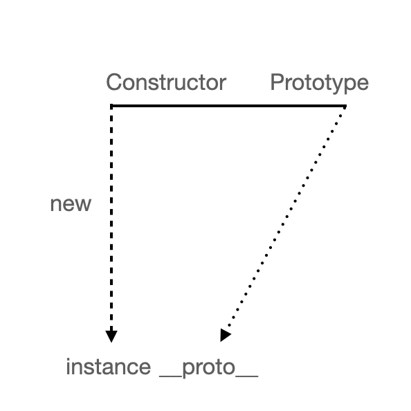

<p>

#### [back](../../../README.md) &nbsp;&nbsp; | &nbsp;&nbsp; write by [Santos](https://github.com/SangchoKim)

</p>

# 1-1.constructor, prototype, instance

<p align="center">
    
</p>

---
<p> * 이 글은 코어자바스크립트 책을 참고하여 기록하였습니다. </p>

> 어떤 객체를 원형(prototype)으로 삼고 이를 참조함으로써 상속과 비슷한 효과를 얻는 프로토타입 기반언어, 자바스크립트


## 1. 프로토타입의 개념

```
- 생성자 함수로 사용할 경우, new 연산자와 함께 함수를 호출할 경우, 생성된 인스턴스에서는 숨겨진 프로퍼티인 __proto__가 자동으로 생성.

- __proto__는 생성자 함수의 prototype 프로퍼티를 참조.

- __proto__프로퍼티는 생략 가능하도록 구현되어 있기 때문에, 생성자 함수의 prototype에 어떤 메서드나 프로퍼티가 있다면 인스턴스에서도 해당 메서드나 프로퍼티에 접근할 수 있음.
```

#### 예시(프로토타입 도식(1)) 😎

<p align="center">
    
</p>

```
#1. 위 그림은 아래의 코드를 추상화 한 것.
var instance = new Constructor();
```

</br>

 <p> * 예시를 통해 알아야 할 것들 🤔 </p>

 1. 어떤 생성자 함수(Constroctor)를 new 연산자와 함께 호출.
 
 2. Constroctor에서 정의된 내용을 바탕으로 새로운 인스턴스(instance)가 생성.

 3. 인스턴스(instance)에는 __proto__라는 프로퍼티가 자동으로 부여됨.

 4. __proto__는 Constroctor의 prototype이라는 프로퍼티를 참조함.

```
- prototype과 이를 참조하는 __proto__는 객체.

- prototype 내부에는 인스턴스가 사용할 메서드를 저장.

- 인스턴스에서는 숨겨진 프로퍼티 __proto__를 통해 prototype 내부에 지정한 메서드들에 접근 가능.
```

</br>

#### 예시(프로토타입 도식(1)을 이용한 코드) 😎

```
#1 
var Person = function (name){
    this._name = name;
}

Person.prototype.getName = function() {
    return this._name;
}

var suzi = new Person('Suzi');
suzi.__proto__.getName();                   // (1) undefined

Person.prototype === suzi.__proto__         // (2) true


#2 
var suzi = new Person('Suzi');
suzi.__proto__._name = 'SUZI__proto__';
suzi.__proto__.getName();                      //  SUZI__proto__


#3 
var suzi = new Person('Suzi', 28);
suzi.getName();                      // Suzi
var iu = new Person('Jieun', 28);
iu.getName();                        // Jieun

suzi.__proto__.getName
-> suzi(.__proto__).getName
-> suzi.getName
```

</br>

 <p> * #1번 예시를 통해 알아야 할 것들 🤔 </p>

 1. Person의 인스턴스는 __proto__프로퍼티를 통해, getName 호출이 가능.

 2. (1)번에서 undefined가 나왔다는 것은 호출할 수 있는 함수에 해당된다는 것을 의미.

 3. (1)번에서 getName 메서드를 호출했을 때 undefined가 나온 까닭은 this에 바인딩 된 대상이 잘못 지정되었음.

 4. 메서드를 호출 할 때 메서드명 바로 앞의 객체가 곧 this, 여기서 this는 suzi.__proto__라는 객체가 되므로, 식별자가 없으니 undefined 반환.

 5. (2)번에서 인스턴스의 __proto__가 Constroctor의 prototype 프로퍼티를 참조, 같은 객체를 바라봄.

  <p> * #2번 예시를 통해 알아야 할 것들 🤔 </p>

 1. suzi.__proto__객체에 name 프로퍼티를 설정. 

 2. #1번 예시와 마찬가지로 getName 메서드를 호출했을 때 this.name의 값은 'SUZI__proto__'

 3. 결론적으로 this의 바인딩이 중요. 

 <p> * #3번 예시를 통해 알아야 할 것들 🤔 </p>

 1. __proto__없이 인스턴스에서 곧바로 메서드를 호출, this.name의 값은 'Suzi', 'Jieun'

 2. __proto__가 생략이 가능한 프로퍼티이기 때문에 정상적으로 출력이 됨.

 3. __proto__를 생략하지 않으면 this는 suzi.__proto__를 가리킴, 생략을 하게되면 suzi를 가리킴. 

```
- new 연산자로 Constructor를 호출하면 instance가 만들어짐.

- 만들어진 instance의 생략 가능한 프로퍼티인 __proto__는 Construtor의 prototype을 참조.
```

</br>


<span>읽어 주셔서 감사합니다.</span>

---

<strong><참고자료></strong>
</br>

[책] [#코어자바스트립트][core-javascript] - 정재남 지음 -
</br>


<strong><클로저></strong> 클로저의 의미 및 원리 이해 end

---

[core-javascript]: https://www.aladin.co.kr/shop/wproduct.aspx?ISBN=K532636268&start=pnaver_02
[naver]: https://www.aladin.co.kr/shop/wproduct.aspx?ISBN=K532636268&start=pnaver_02