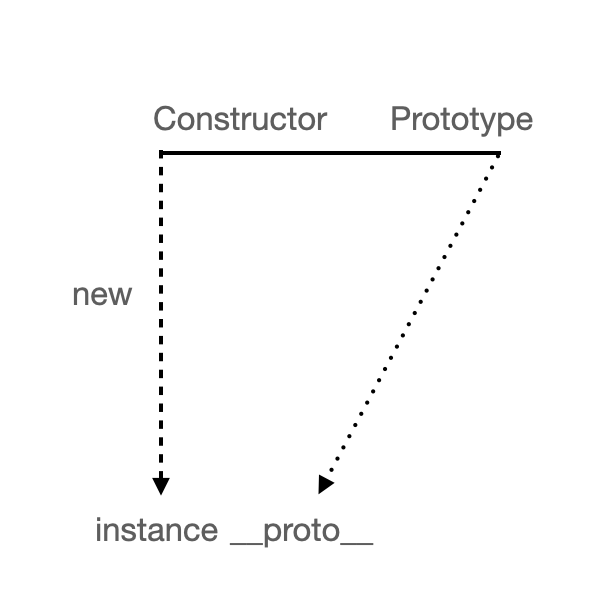

<p>

#### [back](../../../README.md) &nbsp;&nbsp; | &nbsp;&nbsp; write by [Santos](https://github.com/SangchoKim)

</p>

# 1-2.constructor 프로퍼티

<p align="center">
    
</p>

---
<p> * 이 글은 코어자바스크립트 책을 참고하여 기록하였습니다. </p>

> 자기 자신을 참조하는 프로퍼티


## 1. Constructor 프로퍼티

```
- 생성자 함수에 prototype 객체 내부, 인스턴스의 __proto__ 객체 내부에 존재하는 constructor 프로퍼티

- 자기 자신을 참조하는 프로퍼티

- 인스턴스로부터 그 원형이 무엇인지를 알 수 있는 수단이 됨.
```

#### 예시1 (Constructor 프로퍼티) 😎


```
var arr = [1, 2];
Array.prototype.constructor === Array          // true
arr.__proto__.constructor === Array            // true
arr.constructor === Array                      // true

var arr2 = new arr.constructor(3, 4);
console.log(arr2);                             // [3, 4]
```

</br>

 <p> * 예시를 통해 알아야 할 것들 🤔 </p>

 1. 인스턴스 __proto__가 생성자 함수의 prototype 프로퍼티를 참조.

 2. __proto__가 생략 가능하기 때문에 직접 constructor에 접근이 가능. 

</br>

#### 예시2 (constructor 변경) 😎

```
var NewConstructor = function (){
    cossole.log('this is new constuctor!');
};

var dataTypes = [
    1,                      // Number & false
    'test',                 // String & false
    true,                   // Boolean & false
    {},                     // NewConstructor & false
    [],                     // NewConstructor & false
    function() {},          // NewConstructor & false
    /test/,                 // NewConstructor & false
    new Number(),           // NewConstructor & false
    new String(),           // NewConstructor & false
    new Boolean(),          // NewConstructor & false
    new Object(),           // NewConstructor & false
    new Array(),            // NewConstructor & false
    new Function(),         // NewConstructor & false
    new RegExp(),           // NewConstructor & false
    new Date(),             // NewConstructor & false
    new Error(),            // NewConstructor & false
];

dataTypes.forEach(function (d) {
    d.constructor = NewConstructor;
    console.log(d.constructor.name, '&', d instanceof NewConstructor)
});
```

</br>

 <p> * 예시를 통해 알아야 할 것들 🤔 </p>

 1. 읽기 전용 속성이 부여된 에외적인 경우(기본형 리터럴 변수 - number, string, boolean)를 제외하고 값 변경이 가능

 2. 하지만 constructor을 변경하더라도 참조하는 대상만 변경, 인스턴스의 원형이 바뀌거나 데이터 타입이 변하는 것은 아님.

```
- 인스턴스로부터 생성자 정보를 알아내는 유일한 수단인 constructor가 항상 안전한 것은 아니지만, 
그렇기에 클래스 상속을 흉내내는 것이 가능해짐.
```

</br>

#### 예시3 (다양한 constructor 접근 방법) 😎


<p align="center">
    
</p>

```
var Person = function (name){
    this.name = name;
};

var p1 = new Person('사람1');                        // { name: '사람1' } true
var p1Proto = Object.getPrototypeOf(p1);
var p2 = new Person.prototype.constructor('사람2');  // { name: '사람2' } true
var p3 = new p1Proto.constructor('사람3')            // { name: '사람3' } true
var p4 = new p1.__proto__.constructor('사람4');      // { name: '사람4' } true
var p5 = new p1.constructor('사람5');                // { name: '사람5' } true

[p1, p2, p3, p4, p5].forEach(function(p) {
    console.log(p, p instanceOf Person)
});

#1. 모두 동일한 대상을 가리킴
[Constructor]
[Constructor].prototype.constructor
Object.getPrototypeOf([instance]).constructor
[instance].__proto__.construcor
[instance].constructor

#2. 모두 동일한 객체(prototype)에 접근이 가능함.
[Constructor].prototype
Object.getPrototypeOf([instance])
[instance].__proto__
[instance]
```

 <p> * 예시를 통해 알아야 할 것들 🤔 </p>
 
```
 1. 모두 동일한 대상을 가리킴.

 2. 모두 동일한 객체(prototype)에 접근이 가능함.
 
```

</br>

<span>읽어 주셔서 감사합니다.</span>

---

<strong><참고자료></strong>
</br>

[책] [#코어자바스트립트][core-javascript] - 정재남 지음 -
</br>


<strong><프로토타입></strong> constructor 프로퍼티 end

---

[core-javascript]: https://www.aladin.co.kr/shop/wproduct.aspx?ISBN=K532636268&start=pnaver_02
[naver]: https://www.aladin.co.kr/shop/wproduct.aspx?ISBN=K532636268&start=pnaver_02