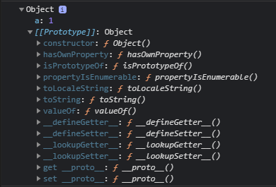

<p>

#### [back](../../../README.md) &nbsp;&nbsp; | &nbsp;&nbsp; write by [Local](https://github.com/blocallee)

</p>

# 2-2 프로토타입 체인

<p align="center">
    
<p> * 이 글은 코어자바스크립트 책을 참고하여 기록하였습니다. </p>
</p>

---

<br>

## 프로토타입 체인

```javascript
console.log({ a: 1 });
```

<p align="center">
  
  <p align="center">그림 6-7. 객체의 내부 구조</p>
</p>

<p>

💡참고💡 `[[prototype]]` 은 내부 슬롯으로 직접 접근은 불가하며, `__proto__` 프로퍼티를 사용하여 간접적으로 접근이 가능하다.</p>

<br>

<p>

`그림 6-7`를 통해서 알 수 있는 것들</p>

- Object 의 인스턴스
- 프로퍼티 a의 값 1
- `[[prototype]]` 내부에 존재하는 메서드들.
- `constructor`은 생성자 함수인 `Object`를 가리키고 있다.

<br>
<br>

<p>배열의 내부 구조</p>
<p align="center">
  
  <p align="center">그림 6-8.</p>
</p>

- `pop`, `push` 등 배열 메서드 및 `constructor` 확인 가능
- `[[prototype]]` 안에 `[[prototype]]` 이 존재하는데<br>
  `그림 6-7`과 동일한 내용으로 이뤄져있다.<br>
  바로 `prototype` 객체가 `'객체'` 이기 때문이다<br>

<br>

<p>

기본적으로 </p>

```
모든 객체의 __proto__에는 Object.prototype이 연결되고
prototype도 예외가 아니다.
```

<br>
<br>

<p>배열의 내부 도식</p>
<p align="center">
  
  <p align="center">그림 6-9.</p>
</p>

<p>

`__proto__` 는 생략 가능하기에</p>

<p>

`Array.prototype` 내부의 메서드를 마치 자신의 것처럼 실행 할 수 있다.</p>

<p>

`__proto__` 를 한 번 더 따라가면 `Object.prototype`도 참조하여 내부의 메소드를 실행할 수 있다.</p>

<br>
<br>

<p>배열에서 배열 메서드 및 객체 메서드 실행</p>

```
var arr = [1,2];
arr(.__proto__).push(3);
arr(.__proto__).hasOwnProperty(2);  // true
```

<p>프로토타입 체인 prototype chain</p>

```
어떤 데이터의 __proto__ 프로퍼티 내부에
다시 __proto__ 프로퍼티가 연쇄적으로 이어진 것.
```

<p>

이 `체인을 따라가며 검색하는 것`을
**_프로토타입 체이닝_** 이라 한다.</p>

<br>

<p>

한마디로 `예제 6-6` 메서드 오버라이드와 동일한 맥락이다.</p>

<p>데이터 자신의 가장 가까운 프로퍼티가 있으면 실행하고</p> 
<p>

없으면 `__proto__` 를 타고 올라가 검색해서 실행하고 </p>

<p>

없으면 또 `__proto__` 를 타고 올라가 검색하여 실행하는 식으로 진행한다.</p>

<br>
<br>

<p>메서드 오버라이드와 프로토타입 체이닝</p>

<p align="center">예제 6-8.</p>

```
01  var arr = [1,2];
02  Array.prototype.toString.call(arr);     //  1, 2
03  Object.prototype.toString.call(arr);    //  [ Object Array ]
04  arr.toString();                         //  1, 2
05
06  arr.toString = function(){
07      return this.join('_');
08  };
09  arr.toString();                         //  1_2
```

- 01 &nbsp; `var arr = [1,2];`
  - `arr` 변수는 `배열` 이므로 arr.**proto** 는 `Array.prototype` 참조

<br>

- 02 &nbsp; `Array.prototype.toString.call(arr);`
  1. `arr`을 `this`로 지정해서 배열을 문자열 `1, 2`로 반환.
  - `Array.prototype`은 객체 이므로 `Array.prototype.__proto__` 는<br>
    `Object.prototype` 을 참조

<br>

- 03 &nbsp; `Object.prototype.toString.call(arr);`
  1. 타입을 문자열로 반환. `[Object Array]`

<br>

- 04 &nbsp; `arr.toString();`
  1. `02` 번째 줄과 동일한 값 `1, 2` 출력.

<br>

- 06 ~ 08 &nbsp; `arr.toString = function(){}`
  1. `arr`에 `toString` 메서드를 부여.

<br>

- 09 &nbsp; `arr.toString();`
  1. `join`으로 각 배열 요소를 `_`로 연결한 문자열 `1_2` 출력.
     - 이제 `04`번째 줄처럼 `Array.prototype.toString`이 실행되지 않고<br>
       `arr`에 직접 부여한 `toString`이 바로 실행.

<br>
<br>

<p> 데이터 타입별 프로토타입 체인 </p>
<p align="center">
  
  <p align="center">그림 6-10.</p>
</p>

<P>

자바스크립트는 위 `그림 6-10` 과 같이 동일한 형태의 프로토타입 체인 구조를 지닌다.</P>

<P>💡 알아둘 점!</p>

1. 위쪽 삼각형에서 우측 꼭짓점에는 무조건 `Object.prototype` 이 있다.

2. 삼각형은 두 개 이상 연결 가능하다.

<br>
<br>

<p> 전체 프로토타입 구조 (중요도 낮음) </p>
<p align="center">
  
  <p align="center">그림 6-11.</p>
</p>

<p>각 생성자 함수는 모두 함수이기 때문에</p>
<p>Function 생성자 함수의 prototype과 연결된다.</p>
<p>Function 생성자 함수도 함수이기 때문에 다시 Function 생성자 함수의 prototype과 연결되는데</p>
<p>이런 식으로 반복하는 루트를 따르면 끝없이 찾아갈 수 있다.</p>
<p>실제 메로리 상에서 데이터를 무한대로 갖고 있는 것이 아닌 </p>
<p>사용자가 이런 식으로 접근하고자 할 때 해당 정보를 얻을 수 있을 것이다.</p>
<p>결국 모두 같은 Function 생성자 함수를 가리키므로 메모리가 낭비될 이유는 없다.</p>

```
어떤 인스턴스가 해당 생성자 함수의 인스턴스인지 여부를 알아야하는 경우를 제외하고

그냥 생성자 함수를 사용하면 된다.
굳이 인스턴스를 통해 접근해야할 필요가 없다.
```
