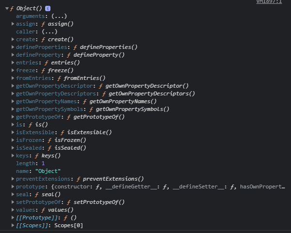

<p>

#### [back](../../../README.md) &nbsp;&nbsp; | &nbsp;&nbsp; write by [Local](https://github.com/blocallee)

</p>

# 2-3 객체 전용 메서드의 예외사항

<p align="center">
    
<p> * 이 글은 코어자바스크립트 책을 참고하여 기록하였습니다. </p>
</p>

---

<br>

## 객체 전용 메서드의 예외사항

```
Object.prototype

- 어떤 생성자 함수나 prototype은 반드시 객체이기에
Object.prototype이 언제나 프토로타입 체인의 최상단에 존재

- 객체에서만 사용할 메서드는 다른 여느 데이터 타입처럼
  프로토타입 객체 안에 정의 불가능.
    -> 그 이유는 Object.prototype 내부에 메서드를 정의를 하면 다른 데이터 타입도
    해당 메서드를 사용할 수 있기 때문.
```

<br>
<br>

<p>

`Object.prototype` 에 추가한 메서드에의 접근</p>

<p align="center">예제 6-9.</p>

```
01  Object.prototype.getEntries = function() {
02      var res = [];
03      for (var prop in this){
04          if (this.hasOwnProperty(prop)){
05              res.push([prop, this[prop]]);
06          }
07      }
08      return res;
09  };
10  var data = [
11      ['object', {a:1, b:2, c:3}],    // [["a",1], ["b", 2], ["c", 3]]
12      ['number', 345],                // []
13      ['string','abc'],               // [["0","a"], ["1","b"], ["2","c"]]
14      ['boolean', false],             // []
15      ['func', function () {}],       // []
16      ['array', [1, 2, 3, 4, 5]]      // Array Iterator {}
17  ];
18  data.forEach(function (datum) {
19      console.log(datum[1].getEntries());
20  });
```

- 01 &nbsp; `Object.prototype.getEntries = function() {`
  1. 객체에서만 사용할 의도로 `getEntries` 메서드를 정의.

<br>

- 18 ~ 20 &nbsp; `data.forEach(function (datum){ ... });`
  1. `11` ~ `16` 번째 줄의 각 데이터마다 <br>
     `getEntries`를 실행.<br>
     -> 그 결과 오류 없이 결과 값을 반환하고 있다.

<br>

<p>프로토타입 체이닝을 통해 </p>
<p>

어느 데이터 타입이건 무조건 `getEntries` 메서드에 접근할 수 있기 때문에 </p>

<p>원래 의도와는 달리 객체가 아닌 다른 데이터 타입에 대해서도</p> 
<p>오류 없이 결과를 반환하고 있다.</p>

<br>
<br>

<p>Object 출력 결과</P>
<p align="center">
  
  <p align="center">그림 6-12.</p>
</p>

<p>

`객체만을 대상으로 동작하는 객체 전용 메서드`들은</p>

```
Object에 스태틱 메서드(static method) 로 부여할 수 밖에 없다.
```

<p>

`생성자 함수인 Object` 와</P>

<p>

`인스턴스인 객체 리터럴` 사이에는 `this`를 통한 연결 불가능하기에</P>

<p>'메서드 앞에 대상이 곧 this' 가 되는 방식의 </P>
<p>this의 사용을 포기하고</P>

```
대상 인스턴스를 인자로 직접 주입해야하는 방식으로 구현돼 있다.
```

<br>
<br>

<p>객체 한정 메서드들이</p>
<p>

`Object.prototype`이 아닌</p>

<p>

`Object`에 **직접 부여할 수 밖에 없던 이유**를 다시 강조하자면</p>

```
Object.prototype이 여타의 참조형 데이터뿐 아니라
기본형 데이터조차 __proto__에 반복 접근함으로써
도달할 수 있는 최상위 존재이기 때문이다.
```

<br>
<br>

<p>Object.prototype 에는</p>
<p>어떤 데이터도 활용할 수 있느 범위의 메서드들이 있다.</p>
<p>모든 변수가 마치 자신의 메서드인 것처럼 호출 가능.</p>

- toString
- hasOwnProperty
- valueOf
- isPrototypeOf
- 등

<br>
<br>
<br>

<p>예외적으로 Object.prototype의 메서드에 접근할 수 없는 경우</p>

```
Object.create를 이용하면 접근할 수 없다.

Object.create(null)은 __proto__ 가 없는 객체를 생성한다.
```

<p>예제</p>

```javascript
var _proto = Object.creat(null);
_proto.getValue = function (key) {
  return this[key];
};
var obj = Object.creat(_proto);
obj.a = 1;
console.log(obj.getValue('a')); // 1
console.dir(obj);
```

<p>

`_proto`에</p>

<p>

`__proto__` 프로퍼티가 없는 객체 할당.</p>

<p>

`obj`는 `_proto`를 `__proto__`로 하는 객체 할당.</p>

<p>

`obj`를 출력 시 `__proto__`에는 오직 getValue 메서드만 존재하고</p>

<p>

`__proto__`와 `constructor` 프로퍼티 등은 보이지 않는다.</p>

<br>

```
이 방식으로 만든 객체는

일반적인 데이터에서 반드시 존재하던

내장(built-in) 메서드 및 프로퍼티들이 제거됨으로써

기본 기능에 제약이 생긴 대신,

객체 자체의 무게가 가벼워짐으로써

성능상 이점을 가진다.
```
