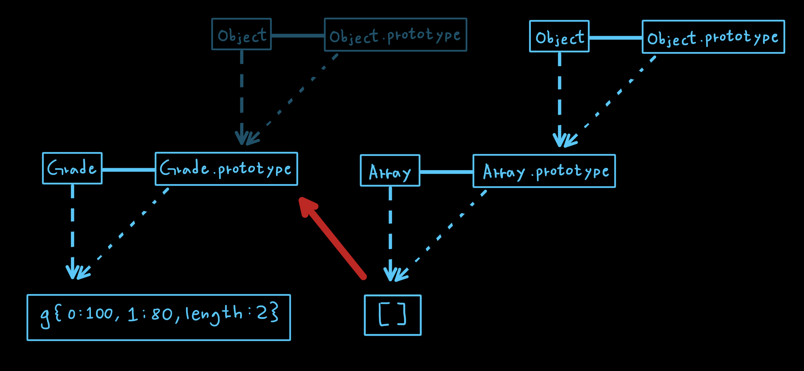
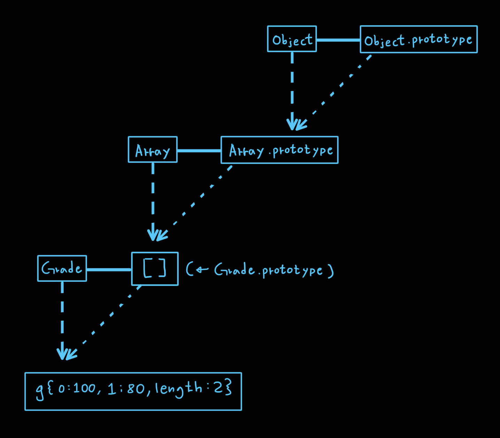

<p>

#### [back](../../../README.md) &nbsp;&nbsp; | &nbsp;&nbsp; write by [Local](https://github.com/blocallee)

</p>

# 2-4 다중 프로토타입 체인

<p align="center">
    
<p> * 이 글은 코어자바스크립트 책을 참고하여 기록하였습니다. </p>
</p>

---

<br>

## 다중 프로토타입 체인

> 대각선의 `__proto__`를 연결해나가기만 하면 무한대로 체인 관계를 이어나갈 수 있다.

<br>
<p>

이 방법으로부터 `다른 언어의 클래스와 비슷하게 동작하는 구조`를 만들 수 있다.</p>

<br>

### 대각선의 `__proto__`를 연결하는 방법

```
__proto__가 가리키는 대상,
즉 생성자 함수의 prototype이 연결하고자 하는

상위 생성자 함수의 인스턴스를 바라보게끔 해주면 된다.
```

<br>

<p>Grade 생성자 함수와 인스턴스</p>
<p align="center">예제 6-10.</p>

```
01  var Grade = function(){
02      var args = Array.prototype.slice.call(arguments);
03      for (var i = 0; i < args.length; i++>){
04          this[i] = args[i];
05      }
06      this.length = args.length;
07  };
08  var g = new Grade(100, 80);
```

- 08 &nbsp; `var g = new Grade(100, 80);`
  1. 변수 `g`에 `Grade` 의 인스턴스 생성하고 인자 `100`과 `80`을 할당하여 담았다.
     - 변수 `g`는 Grade의 인스턴스를 바라본다.

<br>

<p>

`g`가 바라보는 `Grade의 인스턴스`는 배열의 형태를 보이지만</p>

<p>

(`02` ~ `07` 에서 여러 개의 인자를 받아 각각 순서대로 인덱싱해서 저장하고

</P>
<p>length 프로퍼티가 존재하는 등)</P>

```
배열의 메서드를 사용할 수 없는 유사배열객체이다
```

<br>
<br>

<p>Grade의 인스턴스에서 배열 메서드를 직접 쓸 수 있게 만들어보자</P>

```javascript
Grade.prototype = [];
```

<p align="center">
  
  <p align="center">그림 6-13.</p>
</p>

<p>

`Grede의 prototype`에 배열을 할당함으로써</P>

<p>

기존의 `Grade.prototype`이 바라보던 `Object`가 아닌</P>

<p>

`Array`가 연결되었다</P>

<p align="center">
  
  <p align="center">그림 6-14.</p>
</p>

<p>

그렇다고 `Object`와의 연결이 끊어진 것이 아닌</P>

<p>

`Grede.prototype` 은 `Array`를 참조하고</P>

<p>

`Array.prototype`은 `Object`를 참조하는 프로토타입 체인 형태를 띠게 된 것이다.</P>

<br>
<br>

<p>이제 Grade의 인스턴스인 g에서 직접 배열의 메서드 사용 가능</p>

```
console.log(g);     // Grade(2) [100, 80]
g.pop();
console.log(g);     // Grade(1) [100]
g.push();
console.log(g);     // Grade(2) [100, 90]
```

<p>g 인스턴스는 프로토타입 체인에 따라</p>

- g 객체 자신이 가지는 멤버
- Grade의 prototype에 있는 멤버
- Array.prototype에 있는 멤버
- Object.prototype에 있는 멤버

<p>모두 접근이 가능하다</p>
