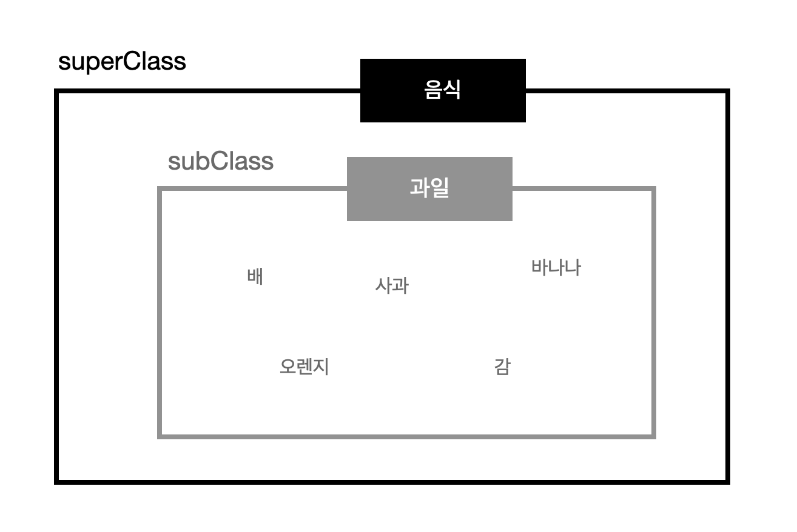
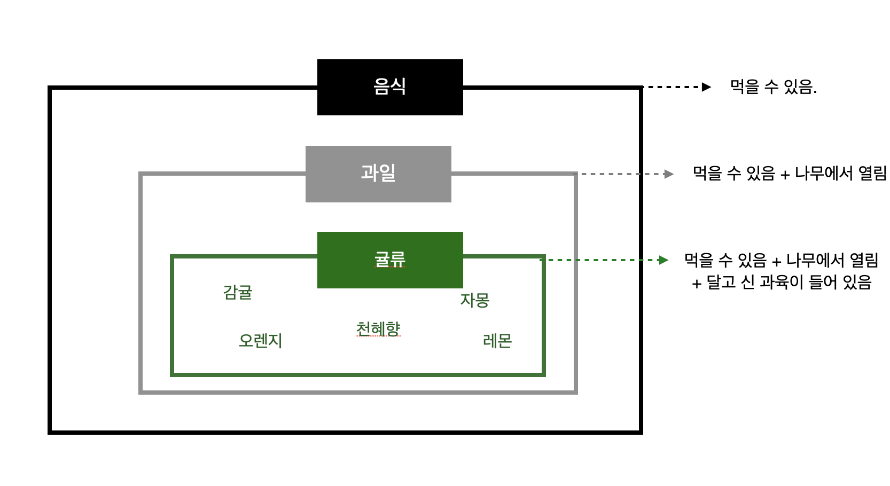

<p>

#### [back](../../../README.md) &nbsp;&nbsp; | &nbsp;&nbsp; write by [Santos](https://github.com/SangchoKim)

</p>

# 1-1.클래스와 인스턴스의 개념 이해

<p align="center">
    
</p>

---
<p> * 이 글은 코어자바스크립트 책을 참고하여 기록하였습니다. </p>

> 


## 1. 클래스와 인스턴스의 개념 이해

```
- 클래스는 어떤 사물들의 공통 속성을 모아 정의한 것, 직접 만질 수도 볼 수도 없는 추상적인 개념.

- 인스턴스는 어떤 클래스들의 속성을 지니는 실존하는 개체.

- 어떤 클래스에 속한 개체는 그 클래스의 조건을 만족했을 때 클래스의 구체적인 예시를 인스턴스라고 함.
```

#### 예시1 (클래스(1)) 😎

<p align="center">
    
</p>

</br>

 <p> * 예시를 통해 알아야 할 것들 🤔 </p>

 1. 음식이라는 범주 안에는 고기, 채소, 과일 등이 들어감.

 2. 고기, 채소, 과일 등 하위에는 각 분류에 속하는 대상들이 포함됨.

 3. 예를 들어 과일 범주 안에는 배, 사과, 바나나, 감, 오렌지 등이 포함.

 4. 배, 사과, 바나나 등은 직접 만지거나 볼 수 있는 실존하는 사물에 해당, 반면 음식, 과일 등은 공통적인 속성을 정의한 추상적인 개념

 5. 음식, 과일은 클래스에 해당, 음식은 과일보다 상위 클래스, 과일은 음식보다 하위 클래스.

</br>

#### 예시2 (클래스 간의 상하관계) 😎

<p align="center">
    
</p>

</br>

 <p> * 예시를 통해 알아야 할 것들 🤔 </p>

 1. 클래스는 상하 관계로도 개념을 지을 수 있음.

 2. 과일은 음식의 subClass 이면서 귤류의 superclass 임.

 3. 귤류는 과일의 subclass, 음식은 귤류의 super-superclass.

 4. 하위 개념은 상위 개념을 포함하면서 더 구체적인 개념이 추가됨.

 5. 여기서 감귤, 자몽, 천혜향 등은 먹을 수 있고, 나무에서 열리며, 달고 신 과육이 들어있는 구체적인 개체, 이를 인스턴스라고 함.

</br>

```
- 결론적으로 클래스는 공통 요소를 지니는 집단을 분류하기 위한 개념, 클래스가 먼저 정의되어야 그로부터 공통적인 요소를 지니는 개체 생성 가능.

- 클래스는 사용하기에 따라 추상적인 대상일 수도 있고 구체적인 개체가 될 수도 있음.
```

</br>

<span>읽어 주셔서 감사합니다.</span>

---

<strong><참고자료></strong>
</br>

[책] [#코어자바스트립트][core-javascript] - 정재남 지음 -
</br>


<strong><클래스></strong> 클래스와 인스턴스의 개념 이해 end

---

[core-javascript]: https://www.aladin.co.kr/shop/wproduct.aspx?ISBN=K532636268&start=pnaver_02
[naver]: https://www.aladin.co.kr/shop/wproduct.aspx?ISBN=K532636268&start=pnaver_02