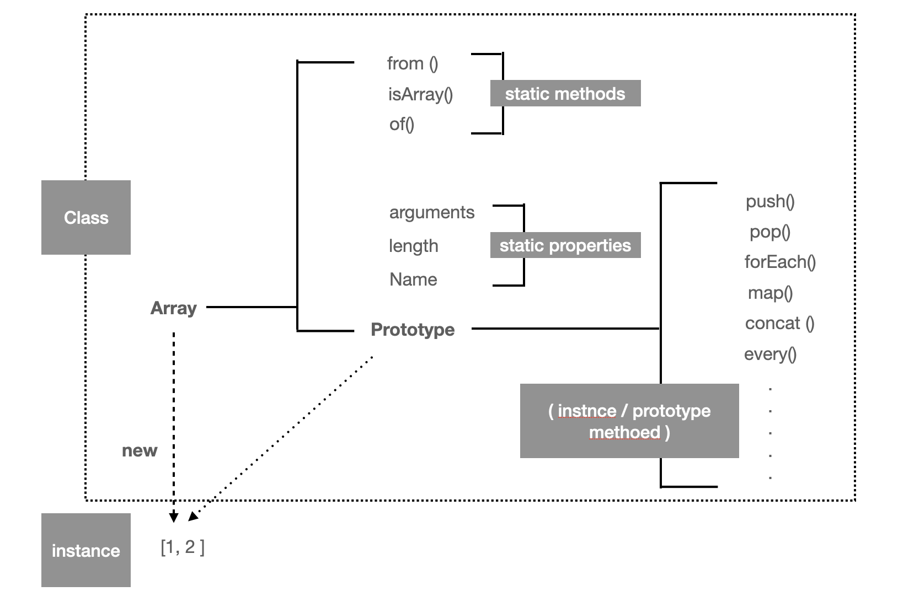

<p>

#### [back](../../../README.md) &nbsp;&nbsp; | &nbsp;&nbsp; write by [Santos](https://github.com/SangchoKim)

</p>

# 2-1. 자바스크립트의 클래스

<p align="center">
    
</p>

---
<p> * 이 글은 코어자바스크립트 책을 참고하여 기록하였습니다. </p>

> 자바스크립트에서 클래스는 사용하기에 따라 추상적일수도 있고 구체적인 개체가 될 수 있음.

<p align="center">
    
</p>

```
- 자바스크립트는 프로토타입 기반 언어이므로 클래스의 개념이 존재하지 않음. 그러나 클래스처럼 비슷하게 해석할 수 있는 요소는 존재함.

- 인스턴스에 상속(참조) 여부에 따라 스태택 메서드, 프로토타입 메서드로 나눔. (클래스에서는 스태틱 멤버와 인스턴스 멤버로 나눔)

- 위의 그림을 참고. (생성자 함수 Array를 new 연산자로 호출 > 인스턴스 생성)
```

## 1. 프로토타입 메서드, 스태틱 메서드

#### 예시 😎

```
#0. 생성자
var Rectangle = function (width, height){
    this.width = width;
    this.height = height;
};

#1. 프로토타입 메서드
Rectangle.prototype.getArea = function() {
    return this.width * this.height;
}

#2. 스태틱 메서드
Rectangle.isRectangle = function (instance){
    return instance instanceof Rectangle && instance.width > 0 instance.height > 0;
};

var rect1 = new Rectangle(3, 4);
console.log(rect1.getArea());                      // 12
console.log(rect1.isRectangle(rect1));             // Error
console.log(Rectangle.isRectangle(rect1));         // true
```

</br>

 <p> * 예시를 통해 알아야 할 것들 (#1 프로토타입 메서드) 🤔 </p>

 1. 프로토타입 메서드인 getArea는 rect1__proto__.getArea에 접근하면서 __proto__를 생략했으므로 this는 rect1이 됨.

 2. rect1.width * rect1.heigth 의 계산값이 반환.

 3. 프로토타입 메서드는 인스턴스에서 직접 호출할 수 있는 메서드.

 <p> * 예시를 통해 알아야 할 것들 (#2 스태틱 메서드) 🤔 </p>

 1. 스태틱 메서드인 isRectangle는 rect1, rect1.__proto__뿐만 아니라 rect1__proto__.__proto__에도 없음. 
 ( rect1__proto____proto__ === Object.prototype )

 2. 인스턴스에서 직접 접근이 불가능한 메서드를 스태틱 메서드라고 함.

 3. 스태틱 메서드는 생성자 함수를 this로 해야 호출이 가능함.

</br>


```
- 결론적으로 인스턴스가 사용할 메서드를 정의한 틀의 역할을 할 때 클래스는 추상적인 개념이지만, 클래스 자체를 this로 해서 직접 접근해야 하는 스태틱 메서드를 사용할 때는 그 자체가 하나의 개체로 사용.

- 그러므로 자바스크립트에서 클래스는 사용하기에 따라 추상적일수도 있고 구체적인 개체가 될 수 있음.
```

</br>

<span>읽어 주셔서 감사합니다.</span>

---

<strong><참고자료></strong>
</br>

[책] [#코어자바스트립트][core-javascript] - 정재남 지음 -
</br>


<strong><클래스></strong> 자바스크립트의 클래스 end

---

[core-javascript]: https://www.aladin.co.kr/shop/wproduct.aspx?ISBN=K532636268&start=pnaver_02
[naver]: https://www.aladin.co.kr/shop/wproduct.aspx?ISBN=K532636268&start=pnaver_02