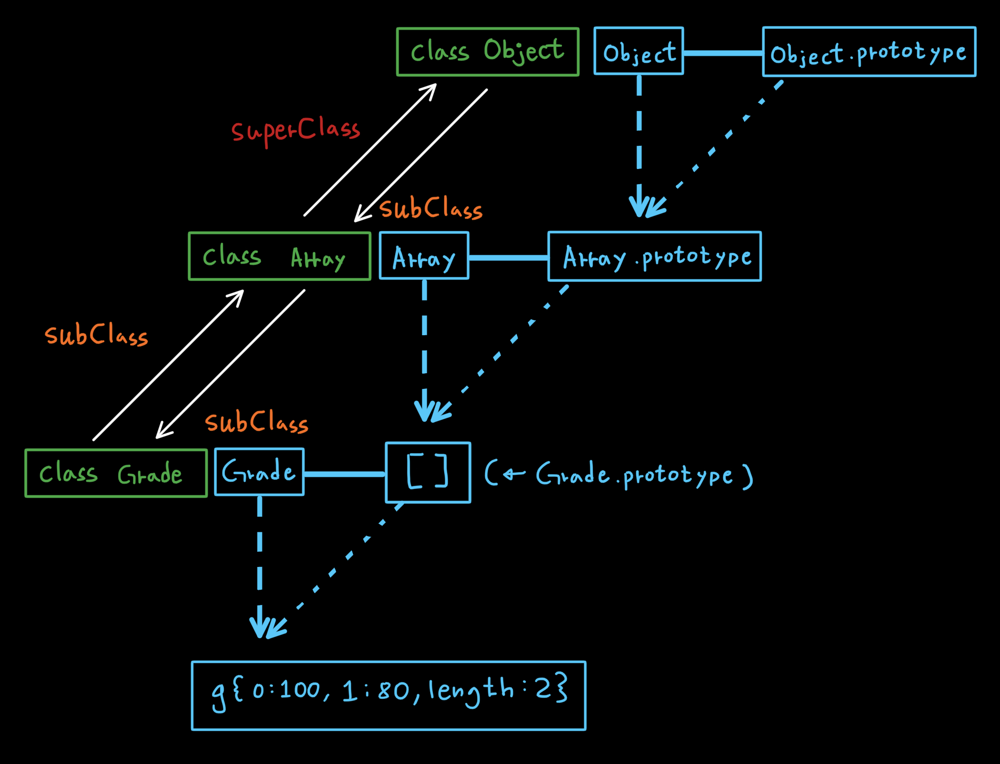
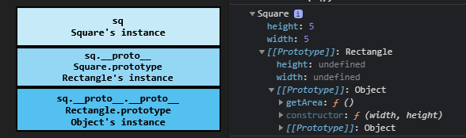
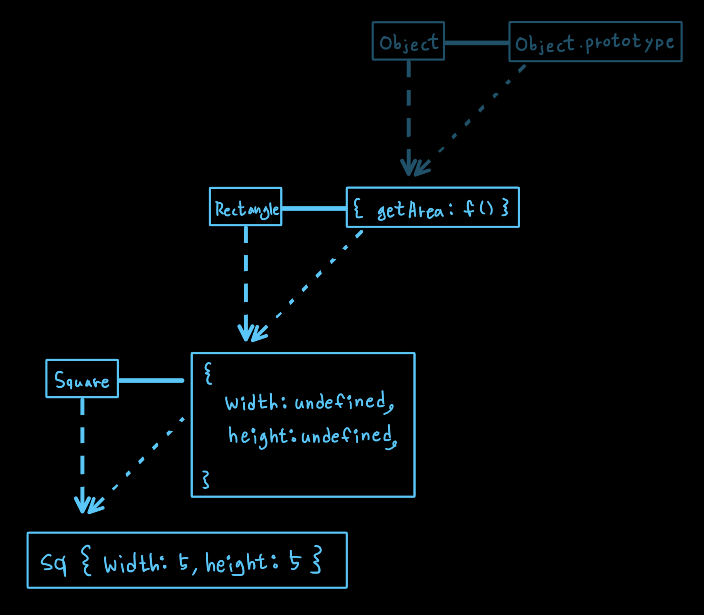

<p>

#### [back](../../../README.md) &nbsp;&nbsp; | &nbsp;&nbsp; write by [Local](https://github.com/blocallee)

</p>

# 3-1 기본 구현

<p align="center">
    
<p> * 이 글은 코어자바스크립트 책을 참고하여 기록하였습니다. </p>
</p>

---

<br>

## 기본 구현

<br>

<p>목표</p>

```
프로토타입 체인을 활용해
클래스 상속을 구현하고

최대한 전통적인 객체지향 언어에서의
클래스와 비슷한 형태로까지 발전시켜 보는 것.
```

<br>
<br>

<p>Grade 생성자 함수와 인스턴스</p>
<p align="center">예제 7-2.</p>

```
01  var Grade = function(){
02      var args = Array.prototype.slice.call(arguments);
03      for (var i = 0; i < args.length; i++){
04          this[i] = args[i];
05      }
06      this.length = args.length;
07  };
08  Grade.prototype = [];
09  var g = new Grade(100, 80);
```

<p>

[예제 6-10](../../06.프로토타입/2.프로토타입체인/2-4.다중프로토타입체인.md)에서 다룬 내용이 클래스 상속의 핵심이다.

</p>

> 자바스크립트에서 '상속'을 구현했다는 것은
> <br>결국 프로토타입 체이닝을 잘 연결했다는 것.

<br>

```
💡 '기본적'으로는 그렇다는 것이지
세부적으로 완벽하게 이뤄진 것은 아니다.
```

<p>

_`예제 7-2` 에는 몇 가지 **문제**가 있다._

<br>
<br>

<p align="center">
  
  <p align="center">그림 7-6.</p>
</p>

<p>

✔ **ES5까지는 class가 없었다** </p>

<p>ES6에서 클래스가 도입됐지만 prototype을 기반으로 한 것으로</p>
<p>

`그림 7-6`의 개념과 동일하다</p>

<br>
<br>

### 문제점 중 `length 프로퍼티를 삭제`한 경우

<br>

<p align="center">예제 7-3.</p>

```
01  var Grade = function(){
02      var args = Array.prototype.slice.call(arguments);
03      for (var i = 0; i < args.length; i++){
04          this[i] = args[i];
05      }
06      this.length = args.length;
07  };
08  Grade.prototype = [];
09  var g = new Grade(100, 80);
---------------------------- 예제 7-2

10  g.push(90);
11  console.log(g);     // Grade { 0: 100, 1: 80, 2: 90, length: 3 }


12  delete g.length;
13  g.push(70);
14  console.log(g);     // Grade { 0: 70, 1: 80, 2: 90, length: 1 }
```

- 10 &nbsp; `g.push(90);`
  - `g` 인스턴스에 `90`을 push 했다.

<br>

- 11 &nbsp; `console.log(g); // Grade { 0: 100, 1: 80, 2: 90, length: 3 }`
  - push한 `90`이 잘 들어갔고 `length` 또한 push한 값 포함해서 `3` 출력.

<br>

- 12 &nbsp; `delete g.length;`
  - 인스턴스 `g`의 `length` 프로퍼티를 삭제.

<br>

- 13 &nbsp; `g.push(70);`
  - 인스턴스 `g`에 `70`을 push

<br>

- 14 &nbsp; `console.log(g); // Grade { 0: 70, 1: 80, 2: 90, length: 1 }`
  - 인스턴스 `g`에 `length` 프로퍼티가 없는 상태에서 `70`을 push 했고<br>
    push 명령에 의해 자바스크립트 엔진이 g.length를 읽고자 하지만 없는 것을 확인.<br>
    프토토타입 체이닝을 타고 `g.__proto__.length`를 읽었고<br>
    `g.__proto__`은 빈 배열이므로 length도 0인 상태.<br>
    여기에 값 `70`을 할당 후 `length`는 `1`만큼 증가 시키라는 명령을 수행하여<br>
    문제없이 동작해 출력됐다.

<br>
<br>

### `Grade.prototype`에 `요소를 포함하는 배열을 매칭`한 경우

<br>

<p align="center">예제 7-4.</p>

```
01  var Grade = function(){
02      var args = Array.prototype.slice.call(arguments);
03      for (var i = 0; i < args.length; i++){
04          this[i] = args[i];
05      }
06      this.length = args.length;
07  };
---------------------------- 예제 7-2

08  Grade.prototype = [ 'a', 'b', 'c', 'd'];  // 요소 포함 배열 매칭
09  var g = new Grade(100, 80);


10  g.push(90);
11  console.log(g);     // Grade { 0: 100, 1: 80, 2: 90, length: 3 }


12  delete g.length;
13  g.push(70);
14  console.log(g);     // Grade { 0: 100, 1: 80, 2: 90, empty, 4: 70, length: 5 }
```

- 08 &nbsp; `Grade.prototype = [ 'a', 'b', 'c', 'd'];`
  - `Grade.prototype`에 요소가 있는 배열 생성

<br>

- 10 &nbsp; `g.push(90);` ,<br>
  11 &nbsp; `console.log(g); // Grade { 0: 100, 1: 80, 2: 90, length: 3 }` ,
  - 문제없이 동작.

<br>

- 12 &nbsp; `delete g.length;`
  - `g.length` 프로퍼티 삭제

<br>

- 13 &nbsp; `g.push(70);`
  - 인스턴스 `g`에 `70`을 push

<br>

- 14 &nbsp; `console.log(g); // Grade { 0: 100, 1: 80, 2: 90, empty, 4: 70, length: 5 }`
  - 자바스크립트 엔진이 `g.length`가 없어 `g.__proto__.length`를 찾는다.<br>
    `g.__proto__`에는 이미 4개의 요소를 가진 배열이 존재하여 `length` 에는 `4`가 할당되어있는 상태.<br>
    `12`번째 줄에서 push 명령으로 `g.__proto__` 배열에 `70`을 `4`번쨰 인덱스에 push 수행.<br>
    `70` push 로 `g.__proto__.legnth`의 값은 `5`가 된다.
    <br>

<br>

```
인스턴스와의 관계에서는
구체적인 데이터를 지니지 않고

오직 인스턴스가 사용할 메서드만을 지니는
추상적인 '틀'로만 작용하게끔 작성하는 것이 좋다.

그렇지 않으면
'예제 7-3', '예제 7-4' 과 같은
예기치 않은 오류가 발생할 가능성을 안고 가야한다.
```

<br>
<br>

### 사용자가 정의한 두 클래스 사이에서의 상속관계 구현

<br>

```
구현 내용

직사각형 : 두 쌍이 마주 보는 변이 평행이고 그 길이가 같다.
정사각형 : 네 변의 길이가 모두 같다

각 클래스에는 넓이를 구하는 getArea 라는 메서드 추가.
```

<br>

<p>Rectangle, Square 클래스 생성</p>
<p align="center">예제 7-5.</p>

```
01  var Rectangle = function (width, height) {
02      this.width = width;
03      this.height = height;
04  };
05  Rectangle.prototype.getArea = function() {
06      return this.width * this.height;
07  };
08  var rect = new Rectangle(3, 4);
09  console.log(rect.getArea());        // 12


10  var Square = function (width) {
11      this.width = width;
12  };
13  Square.prototype.getArea = function() {
14      return this.width * this.width;
15  };
16  var sq = new Square(5);
17  console.log(sq.getArea());          // 25
```

<p>

`예제 7-5` 코드를 보면</p>

<p>

`Rectangle`과 `Square` 클래스의 공통 요소로 `width`가 보인다</p>

<p>

`getArea()`도 내용은 다르지만 비슷하다</p>

<br>
<br>

<p>Square 클래스 변형하여 getArea()도 공통요소로 수정.</p>

```
Squere 에서 width 프로퍼티만 쓰지 않고
height 프로퍼티를 추가하되 width값을 부여하는 형태가 된다면

getArea()도 동일하게 고칠 수 있다.
```

<br>

<p align="center">예제 7-6.</p>

```
01  var Rectangle = function (width, height) {
02      this.width = width;
03      this.height = height;
04  };
05  Rectangle.prototype.getArea = function() {
06      return this.width * this.height;
07  };
08  var rect = new Rectangle(3, 4);
09  console.log(rect.getArea());
------------------------------------- 예제 7-5

10  var Square = function (width) {
11      this.width = width;
12      this.height = width;                    // --- 수정
13  };
14  Square.prototype.getArea = function() {
15      return this.width * this.height;        // --- 수정
16  };
...
```

- 13 &nbsp; `this.height = width;`
  - 정사각형의 '네 변의 길이가 모두 같다' 라는 조건이기 때문에<br>
    `height` 프로퍼티를 추가하여 동일한 `width`값을 할당한다.

<br>

- 14 ~ 16 &nbsp; `Square.prototype.getArea = function() { ... };`
  - `Square`의 `height` 프로퍼티가 추가되어 `Rectangle`의 `getArea()`와 동일한 코드가 됐다.

<br>

<p>

이제 `getArea`라는 메서드는 동일한 동작을 하므로</p>

<p>

`상위 클래스`에만 정의하고</p>

<p>

`하위 클래스`에는 해당 메서드를 상속하면서 `height` 대신 `width`를 넣어주면 된다.</p>

<br>
<br>

<p>Rectangle을 상속하는 Square 클래스</p>

<br>

<p align="center">예제 7-7.</p>

```
01  var Rectangle = function (width, height) {
02      this.width = width;
03      this.height = height;
04  };
05  Rectangle.prototype.getArea = function() {
06      return this.width * this.height;
07  };
08  var rect = new Rectangle(3, 4);
09  console.log(rect.getArea());
------------------------------------- 예제 7-5

10  var Square = function (width) {
11      Rectangle.call(this, width, width);
12  };
13  Square.prototype = new Rectangle();
14  var sq = new Square(5);
15  console.log(sq.getArea());
```

- 11 &nbsp; `this.height = width;`
  - `Rectangle`의 생성자 함수를 함수로써 호출.<br>
    인자 `height` 자리에 `width` 값 전달.

<br>

- 13 &nbsp; `Square.prototype = new Rectangle();`
  - Square 의 프로토타입 객체에 `Rectangle`의 인스턴스를 부여.

<br>

<p>

🚨**위 코드만으로 완벽한 클래스 체계가 구축됐다고 볼 순 없다.**</p>

<p>

`예제 7-4`와 동일한 방법으로 구현했기 때문에</p>

<p>

`클래스에 있는 값이 인스턴스에 영향을 줄수 있는 구조`라는</p>

<p>

`동일한 문제`를 가지고 있을 것이다.</p>

<br>

<p>

`예제 7-6`의 `sq` 인스턴스에 대한 콘솔 출력 결과</p>

```javascript
console.dir(sq);
```

<p align="center">
  
  <p align="center">그림 7-7.</p>
</p>

<p>

`sq`의 구조를 출력한 결과 </p>

1. `Square`
   - `Square`의 인스턴스임을 표시하고<br>
     `width`와 `height`값에 `5`가 할당돼 있다.

<br>

2. `[[Prototype]]: Rectangle`

   - `Rectangle`의 인스턴스임을 표시
   - `width`와 `height` 값이 `undefined` 이다.
     - `width`와 `height`에 `undefined`가 할당돼 있는 것을 확인할 수 있는데<br>
       `Square.prototype`에 값이 존재하는 것이 문제이다.<br>
       만약 이후에 임의로 `Square.prototype.width`(또는 height)에 값을 부여하고<br>
       `sq.width`(또는 height)의 값을 지워버린다면<br>
       **프로토타입 체이닝에 의해 엉뚱한 결과**가 나오게 될 것이다.

    <br>
    <br>

<p>

`Rectangle` --> `Square` 상속 관계 구현 (1) - 도식</p>

<p align="center">
  
  <p align="center">그림 7-8.</p>
</p>

<br>
<br>

<p>

`constructor`가 여전히 `Rectangle`을 바라보고 있는 문제</p>

```
var rect2 = new sq.constructor(2, 3);
console.log(rect2);                     // Rectangle {width: 2, height: 3}
```

<p>

`sq.constructor`로 접근하면 프로토타입 체이닝을 따라 </p>

<p>

`sq.__proto__.__proto__`, 즉 `Rectangle.prototype` 에서 찾게 되며</p>

<p>

이는 `Rectangle` 을 가리키고 있기 때문이다.</p>

<br>

<p>

`하위 클래스`로 삼을 생성자 함수의 `prototype`에</p>

<p>

`상위 클래스`의 인스턴스를 부여하는 것만으로도</p>

<p>

기본적인 메서드 상속은 가능하지만</p>

```
다양한 문제가 발생할 여지가 있어
구조적으로 안전성이 떨어진다.
```
