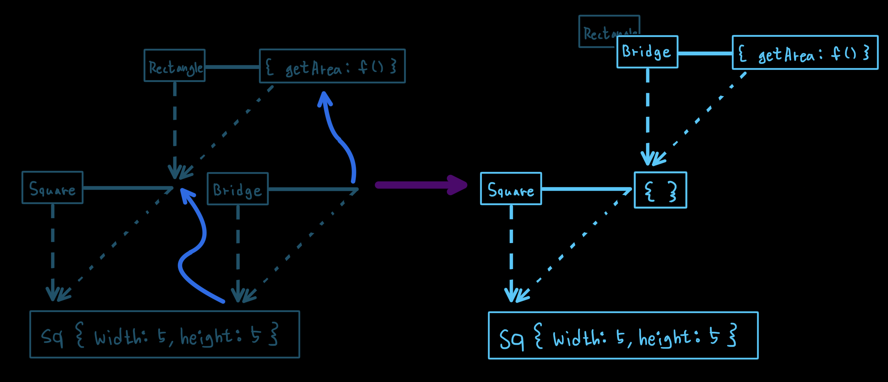

<p>

#### [back](../../../README.md) &nbsp;&nbsp; | &nbsp;&nbsp; write by [Local](https://github.com/blocallee)

</p>

# 3-2 클래스가 구체적인 데이터를 지니지 않게 하는 방법

<p align="center">
    
<p> * 이 글은 코어자바스크립트 책을 참고하여 기록하였습니다. </p>
</p>

---

<br>

## 클래스가 구체적인 데이터를 지니지 않게 하는 방법

<br>

<p>클래스(prototype)가 구체적인 데이터를 지니지 않게 하는 방법은 여러가지가 있다.</p>

```
그 중 가장 쉬운 방법은

일단 만들고 나서
프로퍼티들을 일일히 지우고
더는 새로운 프로퍼티를 추가할 수 없게 하는 것.
```

<br>

```javascript
delete.Square.prototype.width;
delete.Square.prototype.height;
Object.freeze(Square.prototype);
```

<p>프로퍼티가 많다면 반복 작업이 될테니</p>
<p>반복을 없애고</p>
<p>좀 더 범용적으로 이런 동작을 수행할 함수를 만들어보자</p>

<br>
<br>

### 클래스 상속 및 추상화 방법 `(1)` - 인스턴스 생성 후 프로퍼티 제거

<br>

<p align="center">예제 7-8.</p>

```
01  var extendClass1 = function (SuperClass, SubClass, subMethods) {
02      SubClass.prototype = new SuperClass();
03      for (var prop in SubClass.prototype) {
04          if (SubClass.prototype.hasOwnProperty(prop)) {
05              delete SubClass.prototype[prop];
06          }
07      }
08      if (subMethods) {
09          for (var method in subMethods) {
10              SubClass.prototype[method] = subMethods[method];
11          }
12      }
13      Object.freeze(SubClass.prototype);
14      return SubClass;
15  };


16  var Square = extendClass1(Rectangle, function (width) {
17      Rectangle.call(this, width, width);
18  });
```

- 01 &nbsp; `var extendClass1 = function (SuperClass, SubClass, subMethods) {`
  - SuperClass, subClass, subMethods 를 인자로 받아오는 extendClass1 함수 표현식.

<br>

- 02 &nbsp; `SubClass.prototype = new SuperClass();`
  - `SubClass.prototype`에 `SuperClass`의 인스턴스를 할당하여 상속관계를 만들어준다.

<br>

- 03 &nbsp; `for (var prop in SubClass.prototype) {`
  - `SubClass.prototype` 속성들 하나하나 확인하여 반복 작업한다.

<br>

- 04 &nbsp; `if (SubClass.prototype.hasOwnProperty(prop)) {`
  - `SubClass.prototype` 에 prop 과 동일한 프로퍼티를 가지고 있다면

<br>

- 05 &nbsp; `delete SubClass.prototype[prop];`
  - 해당 프로퍼티를 삭제해라

<br>

- 08 &nbsp; `if (subMethods) {`
  - 만약 subMethods 가 true 라면

<br>

- 09 &nbsp; `for (var method in subMethods) {`
  - `subMethods` 속성들 하나하나 확인하여 반복 작업한다.

<br>

- 10 &nbsp; `SubClass.prototype[method] = subMethods[method];`
  - `subClass.prototype`에 `subMethods`의 메서드들을 할당한다.

<br>

- 10 &nbsp; `SubClass.prototype[method] = subMethods[method];`
  - `subClass.prototype`에 새로운 속성을 추가하거나 존재하는 속성을 제거, 변경 등을 방지하기 위해 객체를 동결한다.

<br>

<p>

`예제 7-8`의 `extendClass1` 함수는</p>

<p>

`SuperClass`와 `SubClass`,</p>

<p>

`SubClass`에 추가할 메서드들이 정의된 객체를 받아서</p>

<p>

`SubClass`의 `prototype` 내용을 정리하고 `freeze`하는 내용으로 구성돼 있다.</p>

```
SubClass 의 프로토타입을 정리하는 내용이 다소 복잡했지만
범용성 측면에서는 꽤 괜찮은 방법이다.
```

<br>
<br>

### 클래스 상속 및 추상화 방법 `(2)` - 빈 함수를 활용

<br>

```
더글라스 크락포드가 제시해서 대중적으로 널리 알려진 방법

SubClass의 prototype에
직접 SuperClass의 인스턴스를 할당하는 대신!

아무런 프로퍼티를 생성하지 않는
빈 생성자 함수(Bridge)를 하나 더 만들어
그 prototype이 SuperClass의 prototype을 바라보게끔 한 다음,

SubClass의 prototype에는
Bridge의 인스턴스를 할당하게 하는 것.
```

<br>

```
01  var Rectangle = functio (width, height) {
02      this.width = width;
03      this.height = height;
04  };
05  Rectangle.prototype.getArea = function () {
06      return this.width * this.height;
07  };
08  var Square = function (width) {
09      Rectangle.call(this, width, width);
10  };


11  var Bridge = function () {};
12  Bridge.prototype = Rectangle.prototype;
13  Square.prototype = new Bridge();
14  Object.freeze(Square.prototype);
```

<br>

<p align="center">
  
  <p align="center">그림 7-9.</p>
</p>

<br>

- 11 &nbsp; `var Bridge = function () {};`
  - `Bridge` 라는 빈 함수를 만든다.

<br>

- 12 &nbsp; `Bridge.prototype = Rectangle.prototype;`
  - `Bridge.prototype`이 `Rectangle.prototype;`을 참조하게 한다.

<br>

- 13 &nbsp; `Square.prototype = new Bridge();`
  - `Square.prototype`에 `new Bridge()`로 할당하면 <br>
    `그림 7-9` 에서 우측 그림처럼 `Rectangle` 자리에 `Bridge`가 대체하게 될 것이다.

<br>

<p>이로써</p>
<p>인스턴스를 제외한 프로토타입 체인 경로상에는</p>
<p>

더는 **구체적인 데이터가 남아있지 않게 된다.**</p>

<br>
<br>

<p>범용성으로 고려한 빈 함수 활용한 클래스 상속 및 추상화 방법</p>

<p align="center">예제 7-9.</p>

```
01  var extendClass2 = (function() {
02      var Bridge = function() {};
03      return function (SuperClass, SubClass, subMethods) {
04          Bridge.prototype = SuperClass.prototype;
05          SubClass.prototype = new Bridge();
06          if (subMethods) {
07              for (var method in subMethods) {
08                  SubClass.prototype[method] = subMethods[method];
09              }
10          }
11          Object.freeze(SubClass.prototype);
12          return SubClass;
13      };
14  })();
```

<p>

`extendClass2` 에 즉시실행함수 할당하고</P>

<p>

즉시실행함수 내부에 `Bridge`를 선언해서</P>

<p>

이를 클로저로 활용함으로써 메모리에 불필요한 함수 선언을 줄였다.</P>

<br>

<p>

`subMehtods`에는 `SubClass`의 `prototype`에 담길 메서드들을 객체로 전달하게끔 했다.

<br>
<br>

### ES5에서 도입된 `Object.create`를 이용한 방법.

<br>
<!-- ### 클래스 상속 및 추상화 방법 `(3)` - Object.create 활용 -->

```
SubClass의 prototype의 __proto__가
SubClass의 prototype을 바라보되,

SuperClass의 인스턴스가 되지 않는 방법으로

앞서 소개한 두 방법보다 간단하면서 안전하다.
```

<br>

<p align="center">예제 7-10.</p>

```
// (... 생략)

11  Square.prototype = Object.create(Rectangle.prototype);
12  Object.freeze(Square.prototype);

// (... 생략)
```

- 11 &nbsp; `
  - `Object.create`로 `Rectangle.prototype` 을 가지고 새로운 객체를 만들어<br>
    `Square.prototype`에 지정한다.

<p>클래스 상속 및 추상화를 흉내 내기 위한 라이브러리가 많이 있지만</p>
<p>기본적인 접근 방법은 </p>
<p>위 3가지 아이디어를 크게 벗어나지 않는다</p>

```
결국
SubClass.prototype의 __proto__가 SuperClass.protoType를 참조하고,
SubClass.prototype에는 불필요한 인스턴스 프로퍼티가 남아있지 않으면 된다.
```
